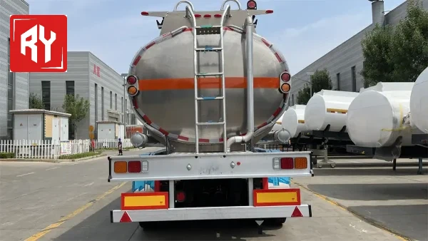
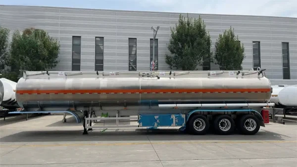
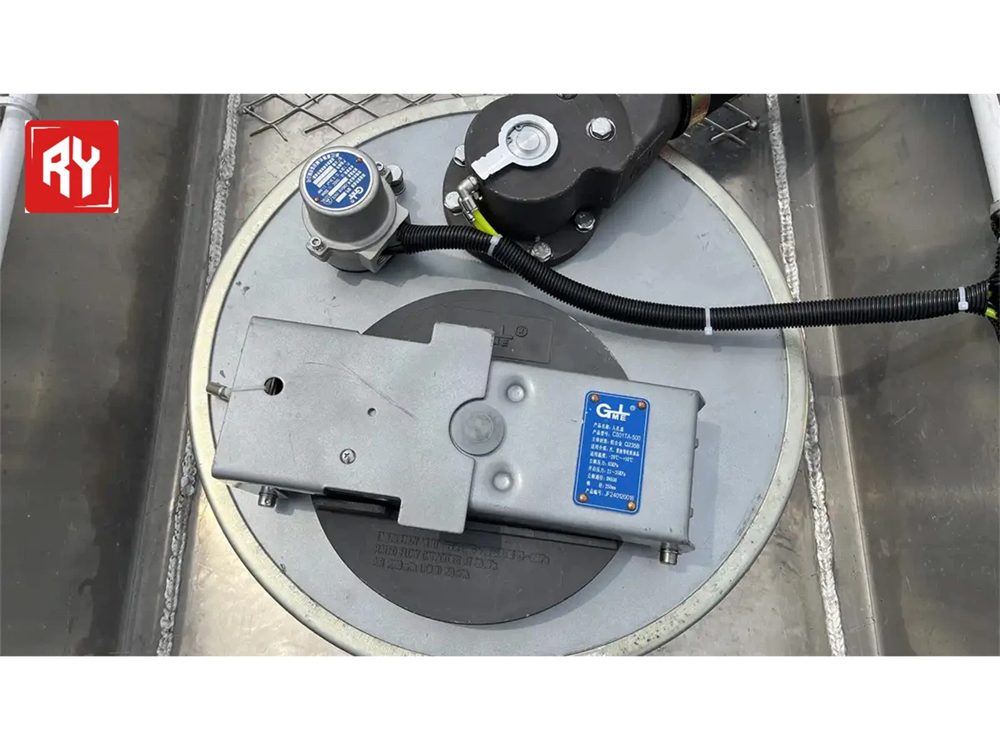
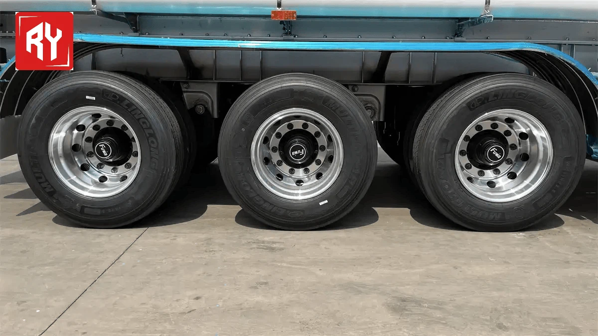

## *Products Description*

  
  01.
The 3 Axle Aluminum Tanker Trailer is designed for safe and efficient transportation of fuels like diesel and gasoline. Its lightweight aluminum construction ensures higher payload capacity and better fuel efficiency, reducing operational costs. The corrosion-resistant material guarantees long-lasting performance, even in harsh environments, while the 2-axle design enhances stability and maneuverability on long-distance hauls.
Built for reliability, this trailer combines durability, safety, and low maintenance, making it an ideal choice for fuel transport businesses. Upgrade your fleet with a high-performance aluminum tanker trailer designed for efficiency and longevity.

02.

 **Brand fuel tank trailer** consists of an oil tank body and a skeleton or bracket supporting the tank body.

The tank body has built-in multi-channel reinforced anti-wave partition boards. There are through holes at the lower end of the partition boards to reduce the impact of the oil in the tank during driving and improve the strength of the tank body.

 

 

## *Specification*

 

| 3 Axles Oil Tank Trailer |                                                              |
| ------------------------ | ------------------------------------------------------------ |
| Tank body                |                                                              |
| Shape                    | Round                                                        |
| Dimension                | 10600mmx2500mm x3750mm (the exact size depends on the final design.) |
|                          |                                                              |
| Tare weight              | 9000kgs/6600kgs/9500kgs                                      |
| Total volume(m³)         | 38000-50000 Liters ( 38-50cbm)                               |
| Tank Body Material       | 5mm carbon steel/ aluminium alloy 5182/stainless steel 304   |
| Bottom Valve             | With                                                         |
| End Plate                | 6mm                                                          |
| Barrel                   | 5mm                                                          |
| Spurnwater               | 6mm                                                          |
| Manhole covers           | 2pcs                                                         |
| Submarine Valve          | 2pcs 4 inches stainless steel valve                          |
| Discharging Valve        | 1pcs 3 inches stainless steel valve,Diameter is 3 or 4 inch  |
| Discharging Pipe         | 3" transparent wire tube, 2 pcs, 5.5m/each                   |
| Stainless steel hose box | Standard                                                     |
| Walk                     | Carbon steel/ aluminium alloy /stainless steel diamond mesh walkway |
| ladder                   | Carbon steel ladder                                          |
| Chassis                  |                                                              |
| Axle                     | 3 pcs                                                        |
| Landing Gear             | JOST brand/ local brand 28T,single acting leg,               |
| Suspension               | Mechanical suspension                                        |
| Leaf Spring              | 10 pcs, standard,                                            |
| Tire                     | 12 units                                                     |
| Rim                      | 9.0 * 22.5, 12pcs                                            |
| ABS                      | Optional Benchi standard, 4S / 2M,                           |
| Air chamber              | 4 double + 2 single,                                         |
| Air tanker               | 50L aluminum air tanker, 2 pcs.                              |
| King Pin                 | JOST 3.5 inch bolt-in king pin,                              |
| Others                   |                                                              |
| Spare wheel carrier      | 1 pc                                                         |
| Fender                   | 1 pc, carbon steel arc fender                                |
| Painting                 | Paint three times, the first coat is anti-rust paint, and the next two coats are topcoat |
| Accessories              | One standard tool box                                        |
| Shipping Terms           | By bulk cargo , RORO or 40HQ containers                      |

## *Products Display*

 

**Flexibility:**

ank capacity and configuration can be customized according to customer needs to adapt to different sizes and types of liquid cargo transportation needs.

**Efficient transportation:**

Designed specifically for liquid cargo transportation, it is able to efficiently transport large quantities of liquid cargo to the destination at one time, improving transportation efficiency.

**Security:**

Strictly abide by safety standards and regulations, equipped with explosion-proof equipment, leakage detection system and other safety devices to ensure the safety of liquid cargo during transportation.

 

## *Detailed Images*

#####  

European System

Reliable European system provides explosion-proof
manhole with anti-overflow capacity and high anti-overflow and oil and gas recovery functionality as well as bottom loading.

Advanced Axle Performance

Integrated advanced low-alloy axle beam
with no welding points; strong capacity and high
strength; axles can be free of maintenance up to 3
years or 400,000 kilometers.

Anti-Tire Abrasion Suspension

Specially designed anti-Tire abrasion suspension
system, prevent tire offset after loading, maximally avoid tire abrasion. Meanwhile, Easy to disassemble and maintain.

Landing Gear

Vehicle Master or JOST landing gear can
be optioned made in aluminum or steel; designed
to work under both high and low temperature in
the range of -30℃ to 120℃.

 

##### FAQ

Q: What is Foreign Trade-Express?

Q: 1. What are the common types of semi-trailers?

Q: 2. What goods are suitable for transport by van semi-trailers?

Q: 3. What are the features of low-bed semi-trailers?

Q: 5. Dump trailers in construction?

Q: 5. Dump trailers in construction?

Q: 6. Can trailers be customized?

Q: 7. Long vs. short-distance trailer use?

Q: 8. Oversize load transport procedures?

Q: 9. Urban delivery with van trailers-pros & cons?

Q: 10. Seasonal operation tips for trailers?

 

 

Hot Tags: 3 Axles 40000 Liters Fuel Tank Semi Trailer Oil Transport Tank, China 3 Axles 40000 Liters Fuel Tank Semi Trailer Oil Transport Tank manufacturers, suppliers, factory, [chemical power transport trailers](https://www.ruiyuantrailer.com/showroom/chemical-power-transport-trailers/), [lng transport trailers](https://www.ruiyuantrailer.com/showroom/lng-transport-trailers/), [power trailer for sale](https://www.ruiyuantrailer.com/showroom/power-trailer-for-sale/), [power transfer trailers](https://www.ruiyuantrailer.com/showroom/power-transfer-trailers/), [propane transport trailers](https://www.ruiyuantrailer.com/showroom/propane-transport-trailers/), [trailer mounted power transport](https://www.ruiyuantrailer.com/showroom/trailer-mounted-power-transport/)