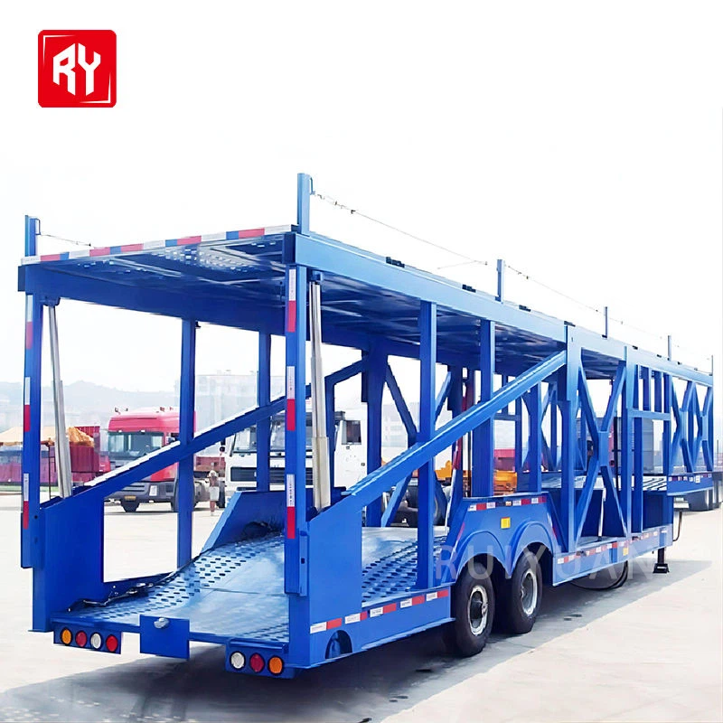
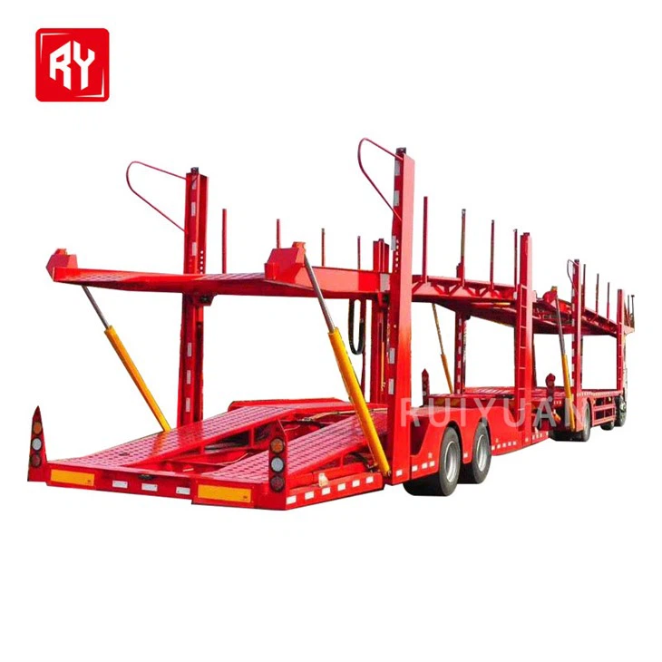

- ## Parameter

   

   

  | **Type:**                  | Semi Trailer                                                 |
  | -------------------------- | ------------------------------------------------------------ |
  | **Product name:**          | Car Carrier Semi Trailer                                     |
  | **Maximum load :**         | 40T                                                          |
  | **Brand:**                 | Shandongruiyuan                                              |
  | **Country of Origin:**     | Shandong,China                                               |
  | **Suitable vehicle type:** | Truck towing                                                 |
  | **Material:**              | Steel                                                        |
  | **Size:**                  | (18000-32000)*2500*4000(mm)                                  |
  | **Landing gear :**         | 28T                                                          |
  | **Kingpin :**              | 2' or 3.5' interchangeable                                   |
  | **Number of cars :**       | 6--12                                                        |
  | **Rim:**                   | 7.50-20 rim or 8.00                                          |
  | **Accessories:**           | One tool box, one set of standard trailer tools              |
  | **Axle:**                  | 3*13ton capacity                                             |
  | **Suspension:**            | Mechanical suspension (air suspension optional)              |
  | **Color:**                 | A variety of colors are available, such as white, yellow, blue, etc. |
  | **Brake:**                 | Dual line pneumatic brake system                             |
  | **Main beam:**             | I-beam, Q345B                                                |

   

  Types of Car Carrier Trailer

   

  The car carrier trailers produced by our company mainly include the following types: 

  Double Deck Car Transport Trailer

  A Car Carrier Semi Trailer is a specialized vehicle transport solution designed to efficiently and safely transport multiple cars, trucks, or SUVs over long distances. Widely used in the automotive industry, dealerships, and vehicle logistics companies, this trailer is essential for moving vehicles from manufacturers to dealerships, auctions, or customer locations.

  2 Axle Car Transporter Trailer

  The two-axle design simplifies the overall structure of the trailer. Compared with multi-axle car transport trailers, it requires fewer components, and the manufacturing process is relatively simple, which directly reduces the purchase cost of the vehicle. This enables small transportation enterprises or individual operators with limited budgets to easily afford it.

  

   

  ##### Key Features of Car Carrier Trailer

   

  Trailer Size and Capacity

  A 16 to 20-foot trailer is ideal for transporting a single vehicle.
  Larger trailers (24 feet or more) can accommodate multiple cars.
  Check the Gross Vehicle Weight Rating (GVWR) to ensure your trailer can handle your vehicle’s weight.

  01

  Material: Steel Vs. Aluminum

  Steel trailers are more durable but heavier and prone to rust.
  Aluminum trailers are lightweight, rust-resistant, and fuel-efficient but may have a higher price tag.

  02

  Trailer Axles

  Single-axle trailers are good for lighter loads but offer less stability.
  Tandem-axle trailers provide better weight distribution and a smoother ride, making them ideal for heavy vehicles or long hauls.

  03

  Ramp or Tilt Mechanism

  Standard ramps are common and cost-effective.
  Tilt beds provide easier loading but come at a higher cost.

  04

  Security Features

  Locking toolboxes for storing straps and equipment
  Tie-down points to secure vehicles during transport
  Enclosed trailers provide additional security against theft

  05

   

  

  Applications of Car Carrier Trailer

  **Automotive Dealerships**
  Car carrier trailers are vital for transporting inventory between dealerships and from manufacturers to showrooms.

  Auction Houses

  Vehicles bought or sold at auctions are often transported using these trailers, ensuring timely delivery.

  Logistics Companies

  Carriers provide an efficient means for delivering vehicles to customers, both domestically and internationally.

  Individual Transport

  Car carrier trailers can be used for personal vehicle transport, saving time and effort.

  Event and Exhibition Transport

  Manufacturers and car enthusiasts use car carrier trailers to transport show cars and prototypes to events.

   

  Loading Process of Car Carrier Trailer

   

   **Arrange the car carrier trailer**
  ● At the front of car hauler, free the tire straps from ratchets. For doing this, pull up the ratchet handle and latch towards you for releasing the strap. Pull strap out of ratchet & towards the rear of car hauler, laying them flat on the deck.
  ● Move the side fender of the driver to a low position by releasing two latches & rotating it right down.
  ● Arrange the loading ramps releasing all the latches, which are holding those ramps and pulling them all out.

   

  **Load the car safely on the car carrying trailer**
  ● Centre the car behind the car hauler
  ● Don't allow anybody to stand in between the towing vehicle & car carrying trailer during loading.
  ● Drive up the ramps slowly and onto the car hauler until the car's tires come to rest against stops in front of the auto transport trailer.
  ● Ensure to position the car in the park & engage the parking brake before exiting it.

   

  **Secure the car properly on the car carrier trailer**
  ● Move the strap ratchets right or left to align them with centre of the tire.
  ● Place the straps up & over the tires at front ensuring they are positioned in the centre.
  ● Look for tie-downs to secure the car to the auto transport trailer properly.
  ● The ratchet needs to be tightened folding the handle down once done.
  ● Fasten the security chains to frame. Leave slack in chain, looping them all around & securing them through open link using s hooks. This needs to be done at the vehicle's front & back side.
  ● Stow the ramps by raising them & sliding the back into the car carrier trailer.
  ● Lift side fender of the driver and secure it properly with the latches.

   

  ##### Customization Options

   

  Size

  1

  \>>

  Suspension

  2

  \>>

  Color

  3

  \>>

  Brake

  4

  \>>

  Landing gear

  5

  \>>

  Packaging Details

  6

   

   

  ## Packaging and Shipping

   

   

  | **Packaging** | Polish with wax before shipping. Naked, or according to customer's needs. |
  | ------------- | ------------------------------------------------------------ |
  | **Shipping**  | We will provide you with the best ocean shipping solution to reduce transportation costs and ensure timely delivery of goods. |

   

   

  ## Our Factory

   

  The production base of Ruiyuan Semi-trailers is located in an industrial park with convenient transportation. The factory area is spacious, and the production equipment is advanced.

   

  

   

  ##### Our Service

   

  **Financing Services**
  A variety of financial services are provided to customers, including vehicle purchase loans, installment payments, etc., to help customers reduce the purchase cost and achieve flexible payment plans.

   

  **Technical Support**
  Comprehensive technical support is provided to help customers understand the applicable scenarios and advantages of different types of semi-trailers, ensuring that their purchasing decisions are reasonable.

   

  **Installation and Debugging**
  Professional installation and debugging services are provided to ensure that all functions of the semi-trailer operate normally, the vehicle meets safety standards, and customers can start using it without worry.

   

  **Technical Support and Training**
  Professional training is provided for vehicle owners and drivers to ensure that the users can master the operation skills and maintenance key points of the semi-trailer proficiently. Ruiyuan also provides regular technical support, including operation manuals, online help, etc., to answer the technical problems encountered by customers during the use process.

   

  **Spare Parts Supply**
  Original spare parts are provided for guarantee. When customers repair or replace spare parts, they can obtain high-quality spare parts produced by Ruiyuan to ensure the performance and safety of the vehicle.

   

  **Product Upgrades and Modifications**
  Ruiyuan also provides modification services for semi-trailers, such as adding additional vehicle-mounted equipment, increasing additional load capacity, etc., to ensure that the semi-trailer meets the changing transportation needs.

   

  **Quality Follow-up and Customer Feedback**
  Ruiyuan will regularly follow up with customers, collect usage feedback, promptly identify potential problems and make improvements to enhance the quality of products and service levels.

   

   

  ## FAQ

   

   

  Q: How many cars can a typical car carrier trailer carry?

  A: An American commercial car carrier typically fits between 5 and 9 cars, depending on the car size and trailer model. The capacity is limited by an 80,000 - lb weight cap that a road vehicle is subject to under U.S. law. Significantly higher - capacity vehicles have been observed around the world, such as a side - by - side loading Chinese model.

  Q: What is the structure of a double - decker car carrier trailer like?

  A: Double - decker commercial car carrier trailers usually have both decks subdivided into a number of loading and storage ramps that can be tilted and lifted independently of one another with hydraulics. To load vehicles on the top deck, the rear half of the deck can tilt and be lowered hydraulically to form a drive - up ramp.

  Q: What about ventilation on car carrier trailers?

  A: Good ventilation is an important feature. It helps prevent moisture buildup and maintains a stable temperature inside the trailer, which is beneficial for the vehicles being transported.

  Q: How should car carrier trailers be operated?

  A: Drivers should follow the operating procedures, ensure that the trailers are properly connected to the tractors, and load and unload the cars carefully. When driving, they need to pay attention to the height and width of the trailer to avoid collisions.

  Q: What are the common maintenance items for car carrier trailers?

  A: Regularly inspect the tires for wear and tear, low tire pressure, and any damage. Lubricate the bearings every 6 months or 10,000 miles to prevent overheating. Clean the exterior and interior of the trailer regularly to remove dirt, debris, and grime. Also, check the lights to ensure they are working properly before each trip.

  Q: What factors should be considered when purchasing a car carrier trailer?

  A: Consider factors such as your intended use (e.g., transporting a single car or multiple cars), budget, towing capacity of your vehicle, and the specific features you need, such as ramp access, rear door, or winch.
