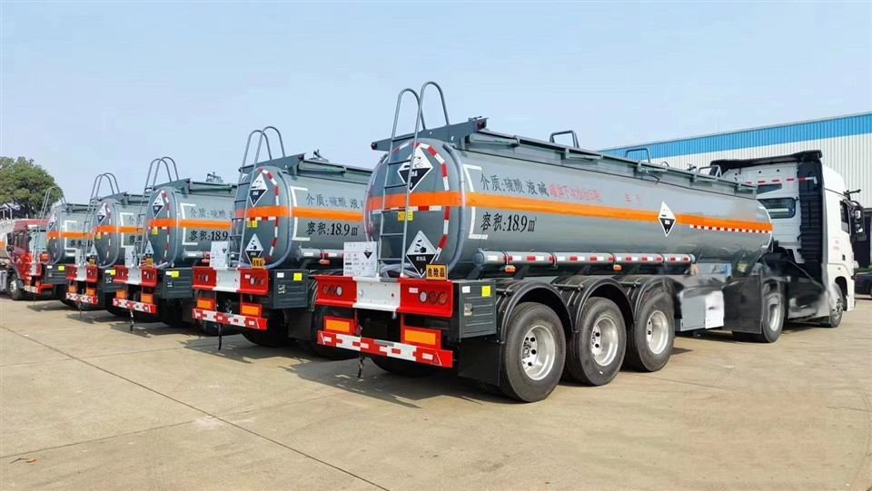
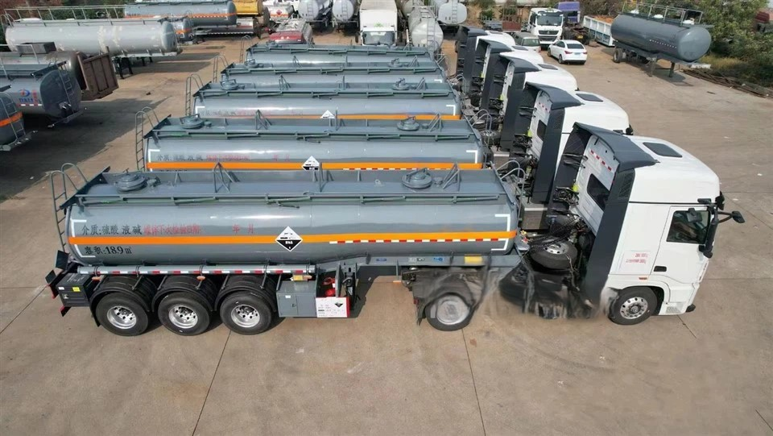

- ## Parameter

   

   

  | **Manufacture**        | Other Size / Single Super Tire Contact with Supplier         |
  | ---------------------- | ------------------------------------------------------------ |
  | **Leaf-spring Pcs**    | 10                                                           |
  | **Axle**               | 13/16/18 T                                                   |
  | **Suspension**         | Heavy Duty Mechanic Suspension with Leaf Springs             |
  | **Tire Size**          | 12R22.5, 12.00R20(Other Size / Single Super Tire Contact with Supplier) |
  | **Main Beam MateriaI** | Q345B manganese plates, automatic submerged arc welded       |
  | **Brake System**       | Dual line braking system with automatic braking system/chambers |
  | **Brake Air Chamber**  | Double Model                                                 |
  | **Kingpin**            | 2' or 3.5' Interchangeable                                   |
  | **Landing gear**       | 28T loading capacity with 80T static lifting capacity.       |
  | **Tanker body**        | 5mm ,sealing end:6mm                                         |
  | **Brake System**       | Dual Lines Braking System With Automatic Air Chambers        |
  | **Brake Air Chamber**  | Four double and two single chamber                           |
  | **Electrical System**  | 24V, 7core socket, lights according to European standards    |
  | **ToOI BOX**           | 1 box of standard tools                                      |
  | **Spare tire carrier** | 2 sets                                                       |
  | **Color and Logo**     | Depends on the buyer's requirement.                          |
  | **Pin Height**         | According to the height of the tractor saddle                |
  | **Painting**           | Three coats painting: Any color will be available            |
  | **Manhole**            | 2pcs                                                         |
  | **Body Material**      | Carbon Steel/ Stainless Steel/Aluminium                      |
  | **Ladders**            | Steel with anti slipper walking way                          |
  | **Fire extinguisher**  | 2x 4kgs                                                      |
  | **Handrai**            | Steel, manual                                                |

   

  Advantages of Chemical Tank Trailer

  **Safety and Compliance**
  Chemical tank trailer are designed and constructed to meet stringent safety standards and regulatory requirements. They incorporate safety features such as pressure relief valves, emergency shut-off systems, and protective enclosures to ensure the secure containment and transport of hazardous chemicals. By using specialized equipment, transporters can maintain compliance with safety regulations and minimize the risk of accidents or spills.

  

  Efficient and Cost-Effective

  Chemical tank trailer are designed for efficiency, allowing for optimized use of transportation resources. They maximize cargo capacity, ensuring more chemicals can be transported in a single trip, reducing transportation costs. Additionally, efficient loading and unloading processes minimize turnaround times and improve overall logistics efficiency.

  Contamination Prevention

  Chemical tank trailer are designed to prevent cross-contamination between different chemicals. They feature separate compartments, dedicated valves, and seals to ensure the integrity and purity of the transported chemicals. This is particularly important for sensitive materials or food-grade chemicals that require stringent quality control.

  Versatility and Compatibility

  Chemical tank trailer are designed to be compatible with various transportation modes, including road, rail, and sea. This versatility allows for seamless transfer between different ways without transloading, saving time and reducing the risk of contamination or product loss during transfer.

  Environmental Considerations

  Chemical tank trailer incorporate environmental considerations into their design. They have features to minimize emissions and prevent leaks or spills that could harm ecosystems. Transporters can use specialized equipment to contribute to sustainable transportation practices and reduce their environmental footprint.

   

  Applications of Chemical Tank Trailer

  **Water Treatment Industry**
  Transports chemicals used in water treatment processes, like sulfuric acid for pH value adjustment, ensuring water quality compliance and protecting water resources.

   

   

   

  **Electronics Industry**
  In semiconductor manufacturing and electronic component production, acid tanker for sale transports acids used for cleaning and etching, such as hydrofluoric acid, ensuring the quality and performance of electronic products.

  Chemical Industry

  Used for transporting various chemical raw materials and intermediates, such as sulfuric acid for fertilizer production and hydrochloric acid for metal processing, ensuring the smooth operation of chemical manufacturing processes.

  Petrochemical Industry

  Chemical tank trailers for sale plays a vital role in the transportation of petroleum additives, catalysts, and other chemical products during oil refining and chemical production, guaranteeing the quality and safety of petrochemical products.

  Oil and Gas Industry

  Utilized for transporting acid chemicals required in oil extraction and processing, such as hydrochloric acid for oil well acidizing, enhancing oil production.

   

  ##### Different Capacities of Chemical Tank Trailers

   

  

  Small Chemical tanker trailer

   

  Capacity usually ranges from a few thousand liters to 10,000 liters. Mainly used to transport some small batches of chemical raw materials.

  Medium-sized Chemical tanker trailer

   

  Capacity usually ranges from 10,000 liters to tens of thousands of liters. Suitable for medium and short distance transportation of a variety of commonly used raw materials chemicals.

  Large Chemical tanker trailer

   

  The capacity usually exceeds tens of thousands of liters and can even reach hundreds of thousands of liters. It is also used for long-distance transportation of some important raw materials that are in high demand. For long-distance bulk transport tasks of bulk chemicals.

  Chemical Tank Trailer Unloading Procedures

   

  **● Inspect the Unloading Area:** Ensure the area is secure, well-ventilated, and equipped with spill containment measures. Check for any potential hazards that could affect the unloading process.
  **● Verify Tank and Chemical Information:** Double-check the tank's contents against the shipping documents to ensure the correct chemical is being unloaded at the correct location.
  **● Equipment Inspection:** Examine hoses, pumps, and valves for any signs of wear, damage, or leaks to prevent spills or exposure during unloading.
  **● Ensuring Compatibility with the Receiving Container:** Ensure the receiving container's compatibility with the chemical to prevent reactions. Verify the container's material, coatings, and previous contents align with safety requirements for the specific chemical.
  **● Grounding and Bonding:** Just like loading, ensure the tanker and receiving container are properly grounded to prevent static electricity build-up.
  **● Connect Hoses and Pumps Correctly:** Ensure that all connections are secure and leak-proof before starting the unloading process.
  **● Begin Unloading Slowly:** Start the pump slowly to prevent splashing and allow time to monitor for leaks or other issues.
  **● Monitor the Process:** Continuously oversee the unloading operation, paying close attention to the tank's pressure and the receiving container's capacity to avoid overfilling.
  **● Shut Down Properly:** Once unloading is complete, carefully disconnect hoses and close valves, ensuring no chemical residue is left that could cause spills.
  **● Handling of Residual Chemicals and Tank Cleaning:** After unloading, properly managing residual chemicals and cleaning the tank.

   

   

  ## Packaging and Shipping

   

   

  | **Packaging** | Polish with wax before shipping. Nude packing.               |
  | ------------- | ------------------------------------------------------------ |
  | **Shipping**  | We will provide you with the best ocean shipping solution to reduce transportation costs and ensure timely delivery of goods.A |

   

   

  ## Our Factory

   

  The production base of Ruiyuan Semi-trailers is located in an industrial park with convenient transportation. The factory area is spacious, and the production equipment is advanced.

   

  

   

  ##### Our Service

   

  **Financing Services**
  A variety of financial services are provided to customers, including vehicle purchase loans, installment payments, etc., to help customers reduce the purchase cost and achieve flexible payment plans.

   

  **Technical Support**
  Comprehensive technical support is provided to help customers understand the applicable scenarios and advantages of different types of semi-trailers, ensuring that their purchasing decisions are reasonable.

   

  **Installation and Debugging**
  Professional installation and debugging services are provided to ensure that all functions of the semi-trailer operate normally, the vehicle meets safety standards, and customers can start using it without worry.

   

  **Technical Support and Training**
  Professional training is provided for vehicle owners and drivers to ensure that the users can master the operation skills and maintenance key points of the semi-trailer proficiently. Ruiyuan also provides regular technical support, including operation manuals, online help, etc., to answer the technical problems encountered by customers during the use process.

   

  **Spare Parts Supply**
  Original spare parts are provided for guarantee. When customers repair or replace spare parts, they can obtain high-quality spare parts produced by Ruiyuan to ensure the performance and safety of the vehicle.

   

  **Product Upgrades and Modifications**
  Ruiyuan also provides modification services for semi-trailers, such as adding additional vehicle-mounted equipment, increasing additional load capacity, etc., to ensure that the semi-trailer meets the changing transportation needs.

   

  **Quality Follow-up and Customer Feedback**
  Ruiyuan will regularly follow up with customers, collect usage feedback, promptly identify potential problems and make improvements to enhance the quality of products and service levels.

   

   

  ## FAQ

   

   

  Q: How often should a chemical tank trailer be inspected?

  A: Chemical tank trailers should be inspected daily before use, and undergo more comprehensive inspections at least once a year by professional technicians. Inspections may be more frequent depending on the type of chemicals transported and the usage frequency.

  Q: What materials are commonly used for the tank body of a chemical tank trailer?

  A: Common materials include stainless steel (such as 304, 316 stainless steel), carbon steel lined with special anti - corrosion materials (like rubber, plastic linings), and alloy steels. The choice depends on the nature of the chemicals being transported.

  Q: Why are safety valves important in chemical tank trailers?

  A: Safety valves are crucial as they prevent excessive pressure build - up inside the tank. When the internal pressure exceeds the set limit, the valve opens to release the pressure, preventing the tank from rupturing and potential chemical leakage.

  Q: How does a leak - detection system in a chemical tank trailer work?

  A: Leak - detection systems use sensors placed at key points in the tank and pipeline. These sensors can detect the presence of chemicals, changes in pressure, or other indicators of a leak. Once a leak is detected, an alarm is triggered to notify the driver or operator.

  Q: How does a chemical tank trailer differ from an ordinary tanker trailer?

  A: Chemical tank trailers are designed to handle hazardous and often corrosive chemicals. They are made of more corrosion - resistant materials, have better - sealed structures, and are equipped with more comprehensive safety devices compared to ordinary tanker trailers used for transporting common non - hazardous liquids like fuel.

  Q: Can chemical tank trailers be customized?

  A: Yes, chemical tank trailers can be customized in terms of tank capacity, material, shape, safety features, and loading/unloading systems to meet the specific requirements of different chemical transportation needs.
