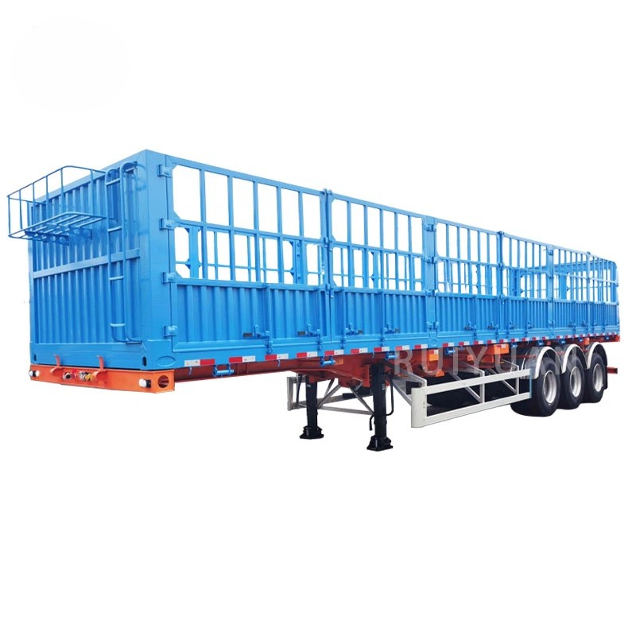
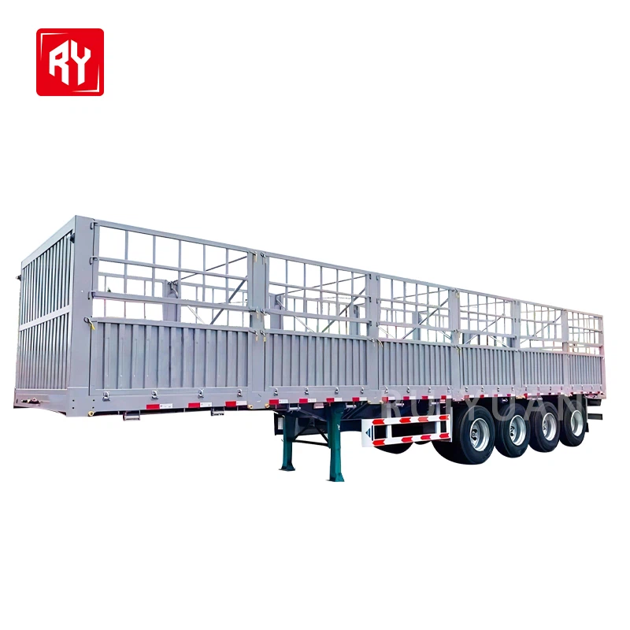

- ## Parameter

   

   

  | **Type:**                  | Semi-trailer                                              |
  | -------------------------- | --------------------------------------------------------- |
  | **Maximum load:**          | 50000kg                                                   |
  | **Brand:**                 | Shandong Ruiyuan                                          |
  | **Country of Origin:**     | Shandong,China                                            |
  | **Suitable vehicle type:** | Truck towing                                              |
  | **Material:**              | Steel                                                     |
  | **Size:**                  | 13000*2500*3500mm (can be customized according to demand) |
  | **Product name:**          | Fence semi trailer                                        |
  | **Axle:**                  | 13T                                                       |
  | **Suspension:**            | Mechanical suspension                                     |
  | **Tire :**                 | 12R22.5                                                   |
  | **Color:**                 | Customer optional                                         |
  | **Landing gear:**          | 28T                                                       |
  | **Kingpin:**               | 2"(50mm) or 3.5"(90mm)                                    |
  | **Axle brand:**            | Shandong local axle (customer can choose)                 |
  | **Usage:**                 | Bulk cargo transport                                      |

   

  Types of Fence Cargo Trailer

   

  The fence cargo trailers produced by our company mainly include the following types: 

  3 Axle Stake Semi Trailer

  Three-axle drop-side semi-trailers are usually equipped with high-quality axles, boasting a powerful load-bearing capacity. The drop sides are made of high-strength steel with an appropriate thickness. They can not only withstand the heavy pressure of a large amount of goods but also are not prone to deformation or damage during long-term use.

  4 Axle Fence Cargo Truck Trailer

  The four - axle design makes the axle load distribution of the vehicle more reasonable, enabling it to bear a greater weight. Generally, the load capacity can reach around 30 - 40 tons. It is suitable for transporting a large quantity of goods, such as building materials, agricultural products, and industrial products.

  

   

   

   

  ##### Advantages of Fence Cargo Trailer

  01.

  Enhanced Security For Cargo

  One of the main advantages of a fence cargo trailer is the added security it provides. The fence ensures that goods do not fall off or get damaged during transport. Whether you’re hauling loose materials or oversized loads, the fence keeps everything in place, reducing the risk of spillage or accidents.

  02.

  Durability And Strength

  Made from high-quality steel or aluminum, fence cargo trailers are built to withstand harsh conditions. Their strong frames can handle heavy-duty tasks, making them suitable for industrial, commercial, and agricultural applications. Whether you’re transporting construction equipment, heavy machinery, or agricultural products, a fence cargo trailer offers exceptional strength.

  03.

  Versatility In Transportation

  Fence cargo trailers are versatile in the types of goods they can carry. From small cargo to large, bulky items, these trailers can handle various loads efficiently. They are especially useful for businesses in need of transporting equipment, livestock, or even pallets that require secure transportation.

  04.

  Cost-Effective Transportation

  Due to their sturdy construction and secure design, fence cargo trailers can reduce the need for extra cargo handling. They ensure safe and stable transport, which can lower costs related to damaged goods, returns, or loss during transit. Additionally, the longevity of these trailers can help save costs on repairs and replacements in the long term.

   

  ##### Uses of Fence Cargo Trailers

   

  Construction Industry:

  Fence cargo trailers are commonly used in the construction industry to transport building materials such as lumber, steel beams, and pipes.

  Manufacturing Industry:

  Manufacturers can use Fence cargo trailers to transport large machinery and equipment to different locations.

  

  Agriculture Industry:

  Farmers and ranchers often use Fence cargo trailers to transport livestock, hay, and other agricultural products.

  Shipping and Logistics Industry:

  Fence cargo trailers are also used by shipping and logistics companies to transport goods that are too large or bulky for traditional enclosed trailers.

   

   

  ## Comparing Fence Cargo Trailers To Other Trailers

   

   

  | **Feature**            | **Fence Cargo Trailer**               | **Low-Flatbed Trailer**          | **Dump Truck**                             |
  | ---------------------- | ------------------------------------- | -------------------------------- | ------------------------------------------ |
  | **Security**           | High (fenced sides)                   | Moderate (open sides)            | Moderate (open sides)                      |
  | **Load Capacity**      | High (open design)                    | Very High (large, flat bed)      | High (for bulk materials)                  |
  | **Ease of Loading**    | Easy (open sides)                     | Easy (low height)                | Moderate (high sides)                      |
  | **Versatility**        | High (varied cargo)                   | Moderate (large equipment)       | Moderate (bulk materials)                  |
  | **Weather Protection** | Low (exposed to weather)              | Low (exposed to weather)         | Low (exposed to weather)                   |
  | **Use Case**           | General cargo, construction materials | Heavy machinery, oversized loads | Bulk material handling, construction sites |

   

  ##### Customization Options

   

  Dimensions

  1

  \>>

  Loading Capacity

  2

  \>>

  Fence Design

  3

  \>>

  Material

  4

  \>>

  Chassis Structure

  5

  \>>

  Color

  6

  \>>

  Axle brand

  7

   

   

  ## Packaging and Shipping

   

   

  | **Packaging** | Polish with wax before shipping. Nude packing.               |
  | ------------- | ------------------------------------------------------------ |
  | **Shipping**  | We will provide you with the best ocean shipping solution to reduce transportation costs and ensure timely delivery of goods |

   

   

  ## Our Factory

   

  The production base of Ruiyuan Semi-trailers is located in an industrial park with convenient transportation. The factory area is spacious, and the production equipment is advanced.

   

  

   

  ##### Our Service

   

  **Financing Services**
  A variety of financial services are provided to customers, including vehicle purchase loans, installment payments, etc., to help customers reduce the purchase cost and achieve flexible payment plans.

   

  **Technical Support**
  Comprehensive technical support is provided to help customers understand the applicable scenarios and advantages of different types of semi-trailers, ensuring that their purchasing decisions are reasonable.

   

  **Installation and Debugging**
  Professional installation and debugging services are provided to ensure that all functions of the semi-trailer operate normally, the vehicle meets safety standards, and customers can start using it without worry.

   

  **Technical Support and Training**
  Professional training is provided for vehicle owners and drivers to ensure that the users can master the operation skills and maintenance key points of the semi-trailer proficiently. Ruiyuan also provides regular technical support, including operation manuals, online help, etc., to answer the technical problems encountered by customers during the use process.

   

  **Spare Parts Supply**
  Original spare parts are provided for guarantee. When customers repair or replace spare parts, they can obtain high-quality spare parts produced by Ruiyuan to ensure the performance and safety of the vehicle.

   

  **Product Upgrades and Modifications**
  Ruiyuan also provides modification services for semi-trailers, such as adding additional vehicle-mounted equipment, increasing additional load capacity, etc., to ensure that the semi-trailer meets the changing transportation needs.

   

  **Quality Follow-up and Customer Feedback**
  Ruiyuan will regularly follow up with customers, collect usage feedback, promptly identify potential problems and make improvements to enhance the quality of products and service levels.

   

   

  ## FAQ

   

   

  Q: What are the common dimensions of fence cargo trailers?

  A: Common lengths range from 9 meters to 13.7 meters, widths are usually around 2.5 meters, and heights can vary from 1.5 meters to 2.2 meters depending on the specific design and application.

  Q: How is the loading capacity of a fence cargo trailer determined?

  A: The loading capacity is determined by factors such as the chassis structure, axle configuration, and tire specifications. It typically ranges from 20 tons to 40 tons, with some larger - sized trailers capable of carrying even more.

  Q: What are the different styles of fence doors on a fence cargo trailer?

  A: There are long - lock - rod double - door, short - lock - rod double - door, left - and - right - opening, up - and - down - opening, double - layer, and single - layer fence doors. Each style has its own advantages and is suitable for different types of goods and loading/unloading methods.

  Q: How often should the tires on a fence cargo trailer be replaced?

  A: The replacement interval of tires depends on factors such as usage frequency, driving conditions, and tire quality. Generally, tires should be inspected regularly, and if there is significant wear, damage, or if they have reached the end of their service life (usually around 50,000 to 100,000 kilometers depending on the type of tire), they should be replaced.

  Q: How many axles does a fence cargo trailer usually have?

  A: Fence cargo trailers typically have 2 to 4 axles. The number of axles is determined based on the expected loading capacity and the requirements of the transportation route. More axles allow for a higher load - bearing capacity.

  Q: How do you ensure a proper connection between the fence cargo trailer and the tractor?

  A: Before towing, it is necessary to check that the king pin is properly aligned with the fifth wheel of the tractor and that the locking mechanism engages securely. Regular inspections of the coupling components for wear and damage should also be carried out to ensure a safe and reliable connection.
