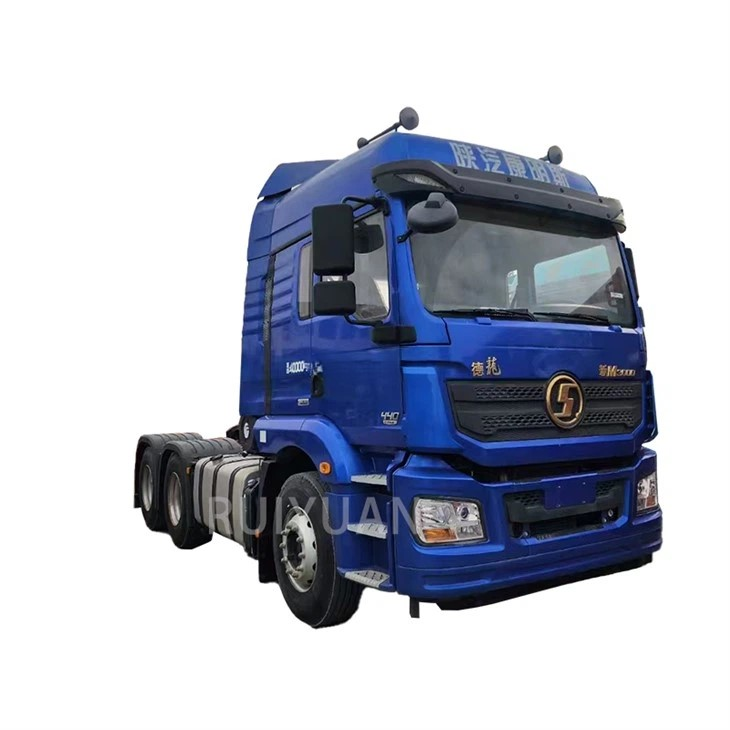
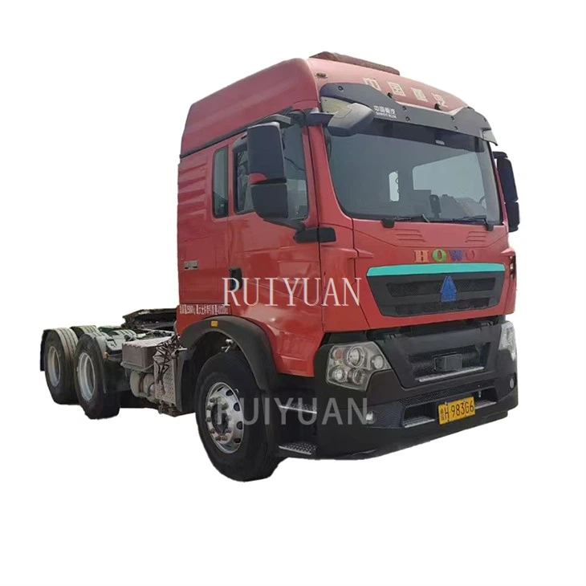

- ## Parameter

   

   

  | **Place of Origin:**                           | Shandong, China                                         |
  | ---------------------------------------------- | ------------------------------------------------------- |
  | **Class:**                                     | Light Truck                                             |
  | **Transmission type:**                         | Automatic/manual                                        |
  | **Maximum torque (Nm):**                       | ≤500nm                                                  |
  | **Container size :**                           | 5660*1840*2120                                          |
  | **Container length :**                         | ≤4.2m                                                   |
  | **Passenger :**                                | 2/4(can be selected according to customer requirements) |
  | **Number of seat rows:**                       | Single/double row                                       |
  | **ABS(Anti-lock braking system)：**            | Is                                                      |
  | **ESC(electronic stability control system)：** | Is                                                      |
  | **Brand**                                      | (Customer can choose)                                   |
  | **Load capacity:**                             | 1-10 tons                                               |
  | **Tank capacity :**                            | 100-200L                                                |
  | **Windows:**                                   | Fully automatic                                         |
  | **Air conditioning:**                          | Manual                                                  |
  | **Number of tires:**                           | 10                                                      |
  | **Recommended payload:**                       | 2T                                                      |
  | **Wheelbase (mm) :**                           | 2850                                                    |
  | **Overall dimension (mm) :**                   | 5660*1840*2120                                          |
  | **Container size (mm) :**                      | 2500*1750*360                                           |
  | **Maintenance quality (Kg):**                  | 2120                                                    |
  | **G.V.W:**                                     | 4120                                                    |
  | **Maximum speed (Km/h):**                      | 90                                                      |

   

  Types of Full Drawbar Trailer

   

  The full drawbar trailers produced by our company mainly include the following types: 

  Two-Axle Dump Drawbar Trailer

  The two-axle tipping drawbar trailer is equipped with an advanced hydraulic self-unloading system, which can complete the unloading of goods in a short time, greatly improving the loading and unloading efficiency. Compared with traditional manual unloading or non-self-unloading trailers, it can save a large amount of time and labor costs.

  Fence Cargo Full Trailer

  The absence of side and top covers on the fence - type full - trailer makes loading and unloading extremely convenient. Cargo can be easily accessed from all sides and the top, enabling the use of various loading and unloading equipment like forklifts, cranes, or even manual labor, depending on the nature of the cargo.

  

   

  Advantages of Full Drawbar Trailer

   

  **Increased Stability**
  Full drawbar trailers are more stable due to how the gooseneck tongue hitches to your vehicle. Rather than straining your bumper, Full drawbar trailers attach to the rear axle. A bumper hitch trailer can exert tremendous leverage on the tow vehicle, making it harder to recover from a situation where you swerve on the road. However, the rear axle is able to handle far more weight than your bumper, which means you can stack on more and take fewer trips.

   

  **Superior Load Transfer and Weight Distribution**
  Another advantage of a Full drawbar trailer is that its weight distribution makes hauling heavy loads easy. Because the gooseneck tongue connects over the top rear axle of the tow vehicle, any lateral pressure is transferred directly to the ground through the truck tires. When loaded properly, a Full drawbar trailer offers better load transfer and weight distribution than many other types of trailers.

   

  **Enhanced Maneuverability**
  Enhanced maneuverability is another notable advantage of a Full drawbar trailer. Full drawbar trailers sit close to the vehicle, and since the truck and hitch pivot in concert with one another, drivers are able to make sharper turns. This is especially helpful when backing the trailer up or when there is limited space for making a u-turn, making sharp turns, navigating around cul-de-sacs, or other hard-to-maneuver spaces.

   

  **Increased Security**
  Anyone can install a bumper hitch onto their vehicle and connect a trailer to the car—a fact that thieves are well aware of. However, because of their unique shape, Full drawbar trailers are not stolen as frequently as bumper hitch trailers. A Full drawbar trailer hitch is made specifically for this type of trailer; it’s much wider than bumper hitches, making it an advantage of a Full drawbar trailer.

   

  ##### Applications of Full Drawbar Trailer

   

  Construction Equipment Transport:

  Used for moving excavators, bulldozers, loaders, and other heavy machinery.

  01

  Agricultural Equipment Hauling:

  Ldeal for carrying large farming machinery such as tractors, harvesters, and plows.

  02

  Industrial and Factory Equipment Transport:

  Suited for moving oversized manufacturing equipment and prefabricated structures.

  03

  Mining and Earthmoving Machinery:

  Perfect for transporting drilling rigs, dump trucks, and other mining equipment.

  04

  Infrastructure and Roadwork Projects:

  Used to move steel structures, bridge components, and heavy construction materials.

  05

   

  

   

  Customization Options

  ● Size
  ● Shaft brand
  ● Suspension
  ● Tire size
  ● Rim size
  ● Tank volume
  ● Total vehicle weight

   

   

  ## Packaging and Shipping

   

   

  | **Packaging** | Polish with wax before shipping. Naked, or according to customer's needs. |
  | ------------- | ------------------------------------------------------------ |
  | **Shipping**  | We will provide you with the best ocean shipping solution to reduce transportation costs and ensure timely delivery of goods. |

   

   

  ## Our Factory

   

  The production base of Ruiyuan Semi-trailers is located in an industrial park with convenient transportation. The factory area is spacious, and the production equipment is advanced.

   

  

  ##### Our Service

   

  **Financing Services**
  A variety of financial services are provided to customers, including vehicle purchase loans, installment payments, etc., to help customers reduce the purchase cost and achieve flexible payment plans.

   

  **Technical Support**
  Comprehensive technical support is provided to help customers understand the applicable scenarios and advantages of different types of semi-trailers, ensuring that their purchasing decisions are reasonable.

   

  **Installation and Debugging**
  Professional installation and debugging services are provided to ensure that all functions of the semi-trailer operate normally, the vehicle meets safety standards, and customers can start using it without worry.

   

  **Technical Support and Training**
  Professional training is provided for vehicle owners and drivers to ensure that the users can master the operation skills and maintenance key points of the semi-trailer proficiently. Ruiyuan also provides regular technical support, including operation manuals, online help, etc., to answer the technical problems encountered by customers during the use process.

   

  **Spare Parts Supply**
  Original spare parts are provided for guarantee. When customers repair or replace spare parts, they can obtain high-quality spare parts produced by Ruiyuan to ensure the performance and safety of the vehicle.

   

  **Product Upgrades and Modifications**
  Ruiyuan also provides modification services for semi-trailers, such as adding additional vehicle-mounted equipment, increasing additional load capacity, etc., to ensure that the semi-trailer meets the changing transportation needs.

   

  **Quality Follow-up and Customer Feedback**
  Ruiyuan will regularly follow up with customers, collect usage feedback, promptly identify potential problems and make improvements to enhance the quality of products and service levels.

   

   

  ## FAQ

   

   

  Q: What is a full drawbar trailer?

  A: A full drawbar trailer is a type of trailer where its entire weight is supported by its own axles and wheels. It is connected to a towing vehicle, such as a truck or tractor, through a drawbar. This drawbar allows the trailer to be pulled by the towing vehicle, and the trailer is designed to carry various types of cargo.

  Q: How does a full drawbar trailer differ from a semi - trailer?

  A: In a semi - trailer, a significant portion of its weight is transferred to the tractor unit through a fifth - wheel coupling. The tractor's rear axle helps support this weight. However, a full drawbar trailer has all of its weight borne by its own axles. The connection to the towing vehicle is via a drawbar, which is different from the fifth - wheel connection of a semi - trailer. This makes full drawbar trailers more independent in terms of weight distribution and also affects their handling characteristics.

  Q: What are the main components of a full drawbar trailer?

  A: The main components include the chassis, which provides the structural framework for the trailer. Axles and wheels are attached to the chassis to support the weight and enable movement. The drawbar is a crucial part, as it connects the trailer to the towing vehicle. Suspension systems, such as mechanical spring suspensions, are installed to reduce vibrations and shocks while the trailer is in motion. Braking systems, often air - brake systems with components like Wabco valves, are used to ensure safe stopping.

  Q: How is a full drawbar trailer connected to the towing vehicle?

  A: It is connected through a drawbar. The drawbar is a long, rigid bar that attaches to the towing vehicle at one end, usually via a hitch or a coupling mechanism. The other end of the drawbar is connected to the trailer. This connection allows the towing vehicle to pull the trailer and also provides a means for the trailer to pivot during turns, enabling it to follow the path of the towing vehicle.

  Q: How do you load and unload a full drawbar trailer?

  A: For flatbed full drawbar trailers, large items can be loaded using cranes or forklifts. Smaller items may be manually loaded. In the case of cargo drawbar trailers with enclosed or semi - enclosed areas, if the cargo is palletized, a forklift can be used to load and unload the pallets through the trailer's doors.

  Q: How often should a full drawbar trailer be maintained?

  A: Regular maintenance is essential. Tires should be checked for proper inflation and tread depth before each use. The braking system should be inspected regularly, at least every few months, to ensure that the brakes are in good working order. The suspension system should be lubricated and checked for any signs of wear or damage on a similar schedule.
