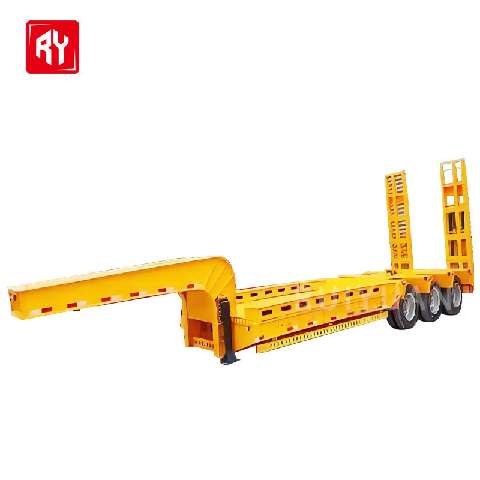
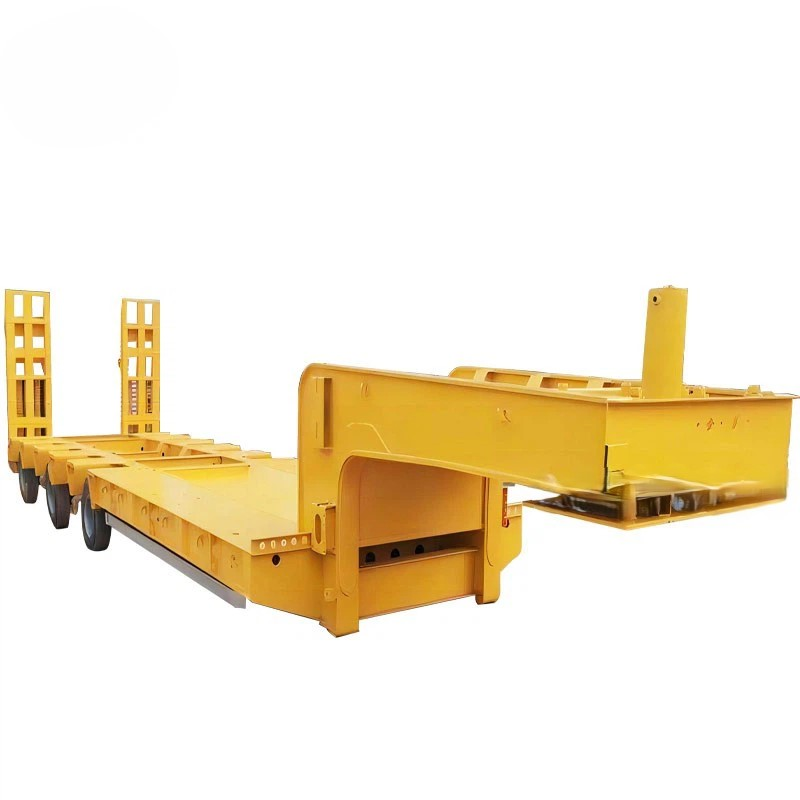

- ## Parameter

   

   

  | **Type:**                        | Semi-trailer                          |
  | -------------------------------- | ------------------------------------- |
  | **Maximum load :**               | 80000 kg                              |
  | **Brand:**                       | Shandong Ruiyuan                      |
  | **Origin :**                     | China                                 |
  | **Suitable vehicle type:**       | Truck towing                          |
  | **Material:**                    | Steel                                 |
  | **Size :**                       | 13000*2500*1650mm (can be customized) |
  | **Axle:**                        | Fuwa (brand can be specified.         |
  | **Suspension:**                  | Mechanical suspension                 |
  | **Brake system:**                | Dual line brake system                |
  | **Color:**                       | Optional                              |
  | **Sales unit:**                  | Single product                        |
  | **Single product package size:** | 500x500x500cm                         |
  | **Gross weight:**                | 500000.000 kg                         |

   

  Types of Removable Gooseneck Trailer

   

  Flatbed trailers

  Flatbed trailers have a flat, level platform without sidewalls or a roof. The open design of flatbed trailers makes them ideal for transporting oversized loads, machinery, construction materials, and other large items that can't fit into enclosed spaces.

  Lowboy trailers

  Lowboy trailers are designed with a very low deck height. They are used to transport tall cargo that can't fit within the standard legal height limit. Lowboy trailers are commonly used to transport construction machinery and equipment.

  

   

   

  ##### Advantages of Removable Gooseneck Trailer

   

  01/

  **Versatility of the Detachable Gooseneck**
  One of the standout features of detachable gooseneck trailers is their versatility. These trailers can be detached from the truck, allowing equipment to be loaded onto the trailer from the front. This feature is particularly advantageous when loading heavy machinery like excavators, bulldozers, or large farm equipment.

  02/

  **Lower Load Height**
  Detachable gooseneck trailers typically have a lower deck height compared to other types of trailers. This lower profile makes them ideal for transporting taller equipment or machinery. By reducing the overall height of the load, these trailers can navigate under bridges and other low-clearance obstacles more easily, expanding the range of routes available for transportation.

  03/

  **Increased Stability**
  The design of gooseneck trailers enhances stability during transport. The gooseneck, which connects the trailer to the truck, provides a stable pivot point, distributing the weight of the load more evenly. This design reduces the risk of trailer sway and improves handling, especially when navigating sharp turns or uneven terrain.

  04/

  **Improved Maneuverability**
  Detachable gooseneck trailers offer excellent maneuverability, particularly in tight spaces or congested work areas. The ability to detach the trailer from the truck allows for easier maneuvering in confined spaces, such as construction sites or loading docks. This feature saves time and reduces the risk of accidents when navigating challenging environments.

  05/

  **Cost Savings**
  While detachable gooseneck trailers may have a higher upfront cost compared to standard trailers, they often provide significant cost savings over time. Their versatility and ability to transport a wide range of equipment make them a valuable investment for businesses that regularly transport heavy loads.

  06/

  **Enhanced Safety**
  Safety is paramount when it comes to transporting heavy equipment. Detachable gooseneck trailers are designed with safety in mind, featuring features such as hydraulic systems for easy loading and unloading, as well as robust construction to withstand heavy loads and rough terrain.

   

  ##### Applications of Removable Gooseneck Trailer

   

  Transporting Heavy Machinery

  ldeal for moving construction equipment, agricultural machinery, and industrial machinery that is heavy and oversized.

  Construction and Infrastructure Projects

  Frequently used in construction and infrastructure projects where heavy and bulky materials need to be moved.

  

  Hauling Oversized Loads

  Used for transporting loads that exceed standard dimensions, such as large pipes, wind turbine blades, and pre-fabricated structures.

  Mining and Energy Sectors

  Suitable for the mining industry for transporting drilling equipment and for the energy sector for moving transformers and other larger components.

   

   

  ## Dimensions of Removable Gooseneck Trailer

   

   

  | **Length** | **Width** | **Weight Capacity (lbs)** |
  | ---------- | --------- | ------------------------- |
  | 40’        | 96”       | 70 000                    |
  | 42’        | 96”       | 70 000                    |
  | 45’        | 96”       | 66 000                    |
  | 48’        | 196”      | 66 000                    |

   

  Getting Started with Removable Gooseneck Trailer Transport

   

  **Step 1: Filling Out the Quote Form**
  The first step in arranging RGN trailer transport is to fill out a simple quote form. This form gathers information about the cargo, including its size, weight, and destination, to provide an accurate cost and timeline estimate.

   

  **Step 2: Consulting with a Transport Agent**
  Once the quote form is submitted, the next step is to speak with a transport agent. This consultation allows for a more personalized service, ensuring that all aspects of the transport, from loading to delivery, are carefully planned and executed. The agent helps to clarify any uncertainties, provides expert advice on the best transport solutions, and ensures that all legal and safety requirements are met. This one-on-one interaction is crucial in tailoring the service to the specific needs of the cargo and the client.

   

  **Step 3: Ensuring Timely Transportation**
  The final step is the actual transportation of the cargo. With a focus on safety and efficiency, RGN trailer transport ensures that even the most challenging loads reach their destination on time and in perfect condition.

   

  ##### Customization Options

   

  Size

  1

  \>>

  Axle brand

  2

  \>>

  Color

  3

  \>>

  Suspension

  4

  \>>

  Brake system

  5

  \>>

  Packaging details

  6

   

  ## Packaging and Shipping

   

   

  | **Packaging** | Polish with wax before shipping. Naked, or according to customer's needs. |
  | ------------- | ------------------------------------------------------------ |
  | **Shipping**  | We will provide you with the best ocean shipping solution to reduce transportation costs and ensure timely delivery of goods. |

   

   

  ## Our Factory

   

  The production base of Ruiyuan Semi-trailers is located in an industrial park with convenient transportation. The factory area is spacious, and the production equipment is advanced.

   

  

   

  ##### Our Service

   

  **Financing Services**
  A variety of financial services are provided to customers, including vehicle purchase loans, installment payments, etc., to help customers reduce the purchase cost and achieve flexible payment plans.

   

  **Technical Support**
  Comprehensive technical support is provided to help customers understand the applicable scenarios and advantages of different types of semi-trailers, ensuring that their purchasing decisions are reasonable.

   

  **Installation and Debugging**
  Professional installation and debugging services are provided to ensure that all functions of the semi-trailer operate normally, the vehicle meets safety standards, and customers can start using it without worry.

   

  **Technical Support and Training**
  Professional training is provided for vehicle owners and drivers to ensure that the users can master the operation skills and maintenance key points of the semi-trailer proficiently. Ruiyuan also provides regular technical support, including operation manuals, online help, etc., to answer the technical problems encountered by customers during the use process.

   

  **Spare Parts Supply**
  Original spare parts are provided for guarantee. When customers repair or replace spare parts, they can obtain high-quality spare parts produced by Ruiyuan to ensure the performance and safety of the vehicle.

   

  **Product Upgrades and Modifications**
  Ruiyuan also provides modification services for semi-trailers, such as adding additional vehicle-mounted equipment, increasing additional load capacity, etc., to ensure that the semi-trailer meets the changing transportation needs.

   

  **Quality Follow-up and Customer Feedback**
  Ruiyuan will regularly follow up with customers, collect usage feedback, promptly identify potential problems and make improvements to enhance the quality of products and service levels.

   

   

  ## FAQ

   

   

  Q: What is a removable gooseneck trailer?

  A: A removable gooseneck trailer (RGN) is a type of flat - deck trailer with a detachable front section that can be lowered and removed to form a ramp for loading and unloading. It's similar to a lowboy trailer but has the unique removable gooseneck feature.

  Q: How does the removable gooseneck mechanism work?

  A: The gooseneck is typically connected to the main deck via a hydraulic or mechanical mechanism. This allows the front section to be raised and detached from the main trailer, creating a ramp for easy loading and unloading of cargo.

  Q: What is the maximum load weight of a removable gooseneck trailer?

  A: RGN trailers can have up to 20 axles or more to support up to 150,000 pounds of cargo weight. However, before trucking permits are required, the maximum load weight is around 42,000 pounds.

  Q: How do you load and unload cargo on a removable gooseneck trailer?

  A: By detaching the gooseneck, the trailer creates a ramp, allowing self - propelled or wheeled machinery to be driven directly onto the trailer. After loading, the tractor backs up to the trailer and re - attaches the gooseneck.

  Q: What kind of maintenance is required for a removable gooseneck trailer?

  A: Regular inspections of the hydraulic systems (if equipped), brakes, tires, and other components are necessary. The gooseneck attachment mechanism should also be checked for wear and tear to ensure proper functioning.

  Q: What are the characteristics of a removable gooseneck truck?

  A: Detachable Gooseneck Trailers are a popular lowboy trailer. The gooseneck detaches from the main deck allowing operators to drive up the front of the main deck. The removable gooseneck is then reattached for transporting the load. The main deck of these units features front flip ramps or a tapered design.
