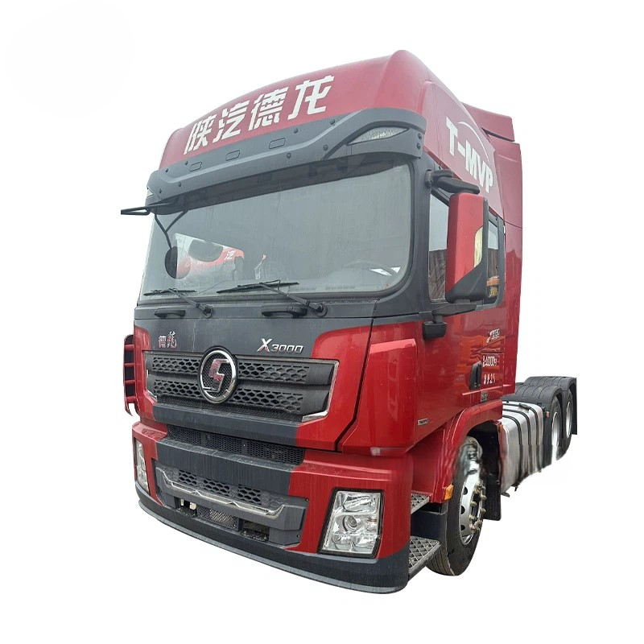
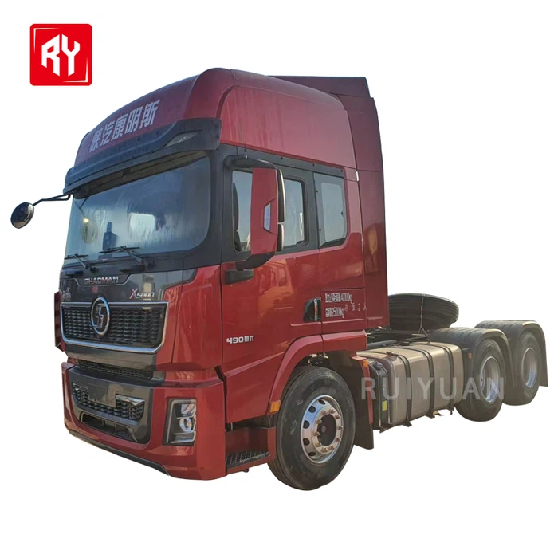
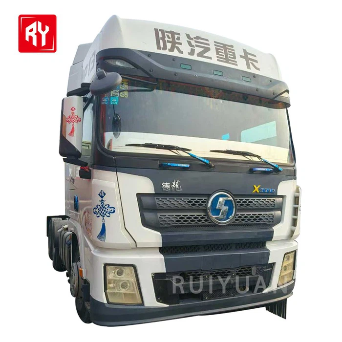

- ## Parameter

   

   

  | **Model:**                    | 8×4 dump truck                                               |
  | ----------------------------- | ------------------------------------------------------------ |
  | **Drive form:**               | 8x4                                                          |
  | **Size:**                     | 10750×2496×3800 mm (8×4 dump truck)                          |
  | **Dump box:**                 | 7800×2300×1800 mm (8×4 dump truck)                           |
  | **Maintenance weight (kg) :** | 15420 (8×4 dump truck)                                       |
  | **Capacity (load)**           | 40-60 tons (8×4 dump truck)                                  |
  | **Engine model:**             | New WP12.400E201, water-cooled, four-stroke, 6-cylinder in-line water-cooled, direct injection (optional) |
  | **Driving style:**            | Left and right hand drive                                    |
  | **Color:**                    | Customer's choice                                            |
  | **Drive type:**               | LHD RHD                                                      |
  | **Transmission type:**        | Automatic/manual                                             |

   

  Types of Shacman Dump Truck

   

  The Shacman dump trucks produced by our company mainly include the following types: 

  SHACMAN 6x4 Dump Truck

  The Shacman Dump Truck exemplifies engineering excellence as a high-performance heavy-duty vehicle, purpose-built for rigorous applications in construction, mining, and bulk material transportation.

  SHACMAN 8x4 Dump Truck

  It is commonly equipped with a high-horsepower engine, such as the Weichai WP10.5H series engine. With its robust power output, it can deliver ample torque, ensuring outstanding power performance even when the vehicle is fully loaded and navigating uphill or through challenging road conditions.

  

   

  Characteristics of Shacman Dump Truck

   

  **Powerful Propulsion**
  It is commonly equipped with a high-horsepower engine, such as the Weichai WP10.5H series engine. With its robust power output, it can deliver ample torque, ensuring outstanding power performance even when the vehicle is fully loaded and navigating uphill or through challenging road conditions.

   

  **High-efficiency Load-bearing**
  It utilizes a high-strength frame and top-quality axles, endowing it with remarkable load-bearing capacity. The 8×4 drive configuration enables a rational distribution of the vehicle's axle load, allowing it to bear substantial cargo weights and meet diverse heavy-duty transportation demands.

   

  **Superior Self-unloading System**
  It is outfitted with an advanced self-unloading mechanism that features rapid lifting speed and high stability. Key components of the self-unloading system, like the cylinders and oil pumps, are typically sourced from renowned brands, ensuring reliable quality. This setup enables a swift and smooth unloading process, significantly enhancing work efficiency.

   

  **Excellent Maneuverability**
  Leveraging advanced chassis technology and a well-designed suspension system, the vehicle exhibits exceptional maneuverability. The steering system is precise and agile, facilitating effortless driving. Even in confined spaces or complex road environments, it can be operated with ease.

  **Enhanced Safety**
  Safety is a top priority in its design, and it comes equipped with a variety of safety features. For example, it is installed with active safety systems such as ABS (Anti-lock Braking System) and EBD (Electronic Brake Force Distribution), which prevent wheel lock-up during emergency braking, ensuring the vehicle's stability and controllability while on the move.

  **Economic Feasibility**
  It excels in fuel economy. Through optimizing the engine-gearbox matching and implementing measures such as lightweight design, it reduces fuel consumption and boosts operational profitability. Meanwhile, the vehicle incurs relatively low maintenance costs. Its components have high interchangeability, making repairs convenient, and it has an extended maintenance cycle, minimizing vehicle downtime and improving operational efficiency.

  **Optimal Comfort**
  The cab is spacious and comfortable, providing a generous interior space. The driver's seat typically offers excellent cushioning and comfort, with multiple adjustable functions, effectively alleviating driver fatigue. Additionally, it is equipped with comfort amenities such as air conditioning and an audio system, creating a pleasant working environment for the driver.

  **High Adaptability**
  It can be customized to meet the specific needs of different users and operating environments. For example, depending on various types of goods and transportation distances, different carriage sizes, materials, and configurations can be selected to satisfy the requirements of diverse special working conditions, demonstrating strong adaptability in the market.

   

   

  ## Applications of Shacman Dump Truck

   

  **Logistics transportation:** Shacman dump truck can be used for long-distance trunk logistics, medium and short distance composite transportation, etc., to meet the needs of cargo transportation.

   

  **Engineering construction:** In construction sites, mines and other places, Shacman dump truck can be used to transport construction materials, earthwork, etc.

   

  **Special transportation:** Including the transportation of dangerous goods, refrigerated transportation, and other special goods.

   

  **City delivery:** Suitable for goods delivery within the city, such as express delivery, supermarket delivery, etc.

   

  **Industrial sector:** Transportation of goods within factories or between factories and suppliers.

   

   

  ##### Braking System of Shacman Dump Truck

  Driving Brake

  Pedal manipulation, dual circuit air brake. The maximum working pressure is 1MPa and the pressure regulating valve cutoff pressure is 1MPa. The first circuit acts on the rear axle (or double rear axle) wheels, and the second circuit acts on the front axle wheels. Once one of the two circuit drops below 0.55 MPa (5.5 bar), the air cylinder pressure indicator light is on. At this moment, park immediately and find out the cause of the pressure leak.

  Auxiliary Brake

  The auxiliary brake is controlled and operated by the button valve mounted on the floor in the left diagonal front of the driver in the cab. The traveling vehicle can execute auxiliary brake by the energy consumed by the engine. When driving down the long slope, the driver must use exhaust brake.

  

  

  Emergency and parking brake

  The manual brake can also be used as emergency brake or parking brake. It achieves its function by the energy storage spring brake cylinder of the rear axle (or double rear axles). The functions of parking brake are achieved by operating the manual brake valve handle.

  Trailer brake (optional device)

  The trailer brake valve is used for the brake of semi-trailer by slowly pulling backward the brake valve handle. It is a brake system independent of tractor.

   

   

  ## Packaging and Shipping

   

   

  | **Packaging** | Polish with wax before shipping.Naked, or according to customer's needs. |
  | ------------- | ------------------------------------------------------------ |
  | **Shipping**  | We will provide you with the best ocean shipping solution to reduce transportation costs and ensure timely delivery of goods. |

   

   

  ## Our Factory

   

  The production base of Ruiyuan Semi-trailers is located in an industrial park with convenient transportation. The factory area is spacious, and the production equipment is advanced.

   

  

   

  ##### Our Service

   

  **Financing Services**
  A variety of financial services are provided to customers, including vehicle purchase loans, installment payments, etc., to help customers reduce the purchase cost and achieve flexible payment plans.

   

  **Technical Support**
  Comprehensive technical support is provided to help customers understand the applicable scenarios and advantages of different types of semi-trailers, ensuring that their purchasing decisions are reasonable.

   

  **Installation and Debugging**
  Professional installation and debugging services are provided to ensure that all functions of the semi-trailer operate normally, the vehicle meets safety standards, and customers can start using it without worry.

   

  **Technical Support and Training**
  Professional training is provided for vehicle owners and drivers to ensure that the users can master the operation skills and maintenance key points of the semi-trailer proficiently. Ruiyuan also provides regular technical support, including operation manuals, online help, etc., to answer the technical problems encountered by customers during the use process.

   

  **Spare Parts Supply**
  Original spare parts are provided for guarantee. When customers repair or replace spare parts, they can obtain high-quality spare parts produced by Ruiyuan to ensure the performance and safety of the vehicle.

   

  **Product Upgrades and Modifications**
  Ruiyuan also provides modification services for semi-trailers, such as adding additional vehicle-mounted equipment, increasing additional load capacity, etc., to ensure that the semi-trailer meets the changing transportation needs.

   

  **Quality Follow-up and Customer Feedback**
  Ruiyuan will regularly follow up with customers, collect usage feedback, promptly identify potential problems and make improvements to enhance the quality of products and service levels.

   

   

  ## FAQ

   

   

  Q: What safety features does a Shacman dump truck have?

  A: It is equipped with an anti - lock braking system (ABS), which can improve the braking performance of the vehicle and prevent the wheels from locking during braking. The cab has a strong structure and has passed the European "ECE - R29" strict collision test standard, which can provide good protection for the driver. In addition, some models are also equipped with a tire pressure monitoring system, an electronic braking system (EBS), etc., which can improve the safety of the vehicle.

  Q: What is the fuel consumption of a Shacman dump truck?

  A: The fuel consumption of Shacman dump trucks is affected by many factors, such as load, road conditions, and driving habits. Generally, the fuel consumption per 100 kilometers is about 35 - 50 L for 20 - ton models and 40 - 60 L for 30 - ton models.

  Q: What is the load carrying capacity range of Shacman dump trucks?

  A: The load - carrying capacity of Shacman dump trucks varies by model, generally ranging from 20 to 30 tons or more. For example, the 6x4 - drive model can carry about 20 - 25 tons, and the 8x4 - drive model can carry about 30 tons.

  Q: What engines do Shacman trucks use?

  A: Two of the most prominent engine options for Shacman trucks are Weichai and Cummins engines. Weichai engines are a symbol of strength and innovation. Known for their durability, these engines are built to withstand the toughest of challenges.

  Q: How many gears does Shacman truck have?

  A: Do not perform the gear-jumping operation in low and high range shifting, like from 5th gear to 7th, or 8th to 6th gear, otherwise it will damage deputy box synchronizer. The deputy box only switch to the range selected when the gear is at Neutral.

  Q: Are Shacman trucks reliable?

  A: Shacman trucks have earned a reputation for their unwavering reliability, standing out as a true powerhouse in the world of commercial vehicles. These trucks are engineered with precision and crafted with a commitment to excellence that is second to none.
