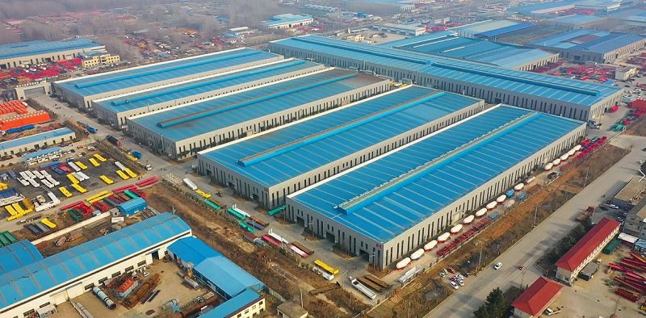

- tain a sufficient safety distance in the driving process, so that in case of emergency there is enough time and space for braking or avoiding.

   

  **Responding to Emergencies**
  In the process of driving, Shacman Tractor Truck drivers may encounter a variety of unexpected situations, such as road congestion, vehicle failure and so on. At this time, the driver should remain calm, rapid judgments and make the correct response.

   

   

  ## Packaging and Shipping

   

   

  | **Packaging** | Polish with wax before shipping.Naked, or according to customer's needs. |
  | ------------- | ------------------------------------------------------------ |
  | **Shipping**  | We will provide you with the best ocean shipping solution to reduce transportation costs and ensure timely delivery of goods. |

   

   

  ## Our Factory

   

  The production base of Ruiyuan Semi-trailers is located in an industrial park with convenient transportation. The factory area is spacious, and the production equipment is advanced.

   

  

   

  ##### Our Service

   

  **Financing Services**
  A variety of financial services are provided to customers, including vehicle purchase loans, installment payments, etc., to help customers reduce the purchase cost and achieve flexible payment plans.

   

  **Technical Support**
  Comprehensive technical support is provided to help customers understand the applicable scenarios and advantages of different types of semi-trailers, ensuring that their purchasing decisions are reasonable.

   

  **Installation and Debugging**
  Professional installation and debugging services are provided to ensure that all functions of the semi-trailer operate normally, the vehicle meets safety standards, and customers can start using it without worry.

   

  **Technical Support and Training**
  Professional training is provided for vehicle owners and drivers to ensure that the users can master the operation skills and maintenance key points of the semi-trailer proficiently. Ruiyuan also provides regular technical support, including operation manuals, online help, etc., to answer the technical problems encountered by customers during the use process.

   

  **Spare Parts Supply**
  Original spare parts are provided for guarantee. When customers repair or replace spare parts, they can obtain high-quality spare parts produced by Ruiyuan to ensure the performance and safety of the vehicle.

   

  **Product Upgrades and Modifications**
  Ruiyuan also provides modification services for semi-trailers, such as adding additional vehicle-mounted equipment, increasing additional load capacity, etc., to ensure that the semi-trailer meets the changing transportation needs.

   

  **Quality Follow-up and Customer Feedback**
  Ruiyuan will regularly follow up with customers, collect usage feedback, promptly identify potential problems and make improvements to enhance the quality of products and service levels.

   

   

  ## FAQ

   

   

  Q: What engines do Shacman trucks use?

  A: Two of the most prominent engine options for Shacman trucks are Weichai and Cummins engines. Weichai engines are a symbol of strength and innovation. Known for their durability, these engines are built to withstand the toughest of challenges.

  Q: What is a Shacman tractor truck?

  A: A Shacman tractor truck is a heavy - duty vehicle designed for hauling semi - trailers. It serves as the power unit that couples with trailers to transport large volumes of cargo over long distances. Shacman, a well - known brand in the commercial vehicle industry, manufactures these trucks with a focus on performance, durability, and reliability.

  Q: What is the load carrying capacity of Shacman tractor trucks?

  A: Load - carrying capacity varies by model and configuration. A 6x4 Shacman tractor truck can typically tow semi - trailers with payloads ranging from around 30 to 50 tons or more. For instance, some heavy - duty 6x4 models are designed to handle trailers loaded with up to 40 - 50 tons of cargo, making them suitable for transporting large quantities of construction materials, industrial goods, or containers.

  Q: What safety features are equipped in Shacman tractor trucks?

  A: Shacman tractor trucks come with multiple safety features. They are equipped with a dual - circuit compressed - air brake system for reliable braking. An anti - lock braking system (ABS) is often included, which helps prevent wheel lock - up during braking, especially in emergency situations. Some models may also have features like an electronic stability control (ESC) system to enhance vehicle stability.

  Q: What is the warranty period for Shacman tractor trucks?

  A: The warranty period for Shacman tractor trucks typically ranges from 1 to 3 years, depending on the model and the specific terms set by the manufacturer. During this warranty period, Shacman will cover the cost of repairing or replacing defective parts under normal usage conditions.

  Q: How does the transmission system of Shacman tractor trucks work?

  A: Shacman tractor trucks use different types of transmission systems, with manual and automated manual transmissions (AMT) being common. In a manual transmission system, the driver uses a clutch pedal and a gear shifter to change gears.
