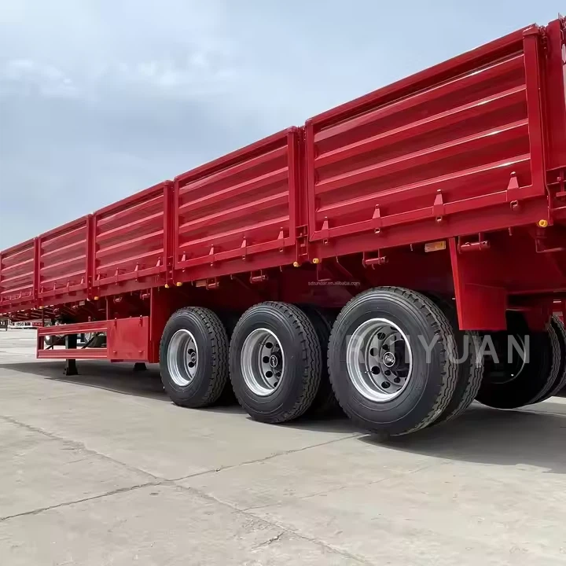

- ## Parameter

   

   

  | **Application**              | Coal/Mine/Sand/Stone Transportation                          |
  | ---------------------------- | ------------------------------------------------------------ |
  | **Dump Style**               | Side Dump                                                    |
  | **Loading Capacity**         | 30-100 Tons                                                  |
  | **Axles**                    | 3/4 Axles 13/16 TonsVEHICLE MASTER FUWA/BPW                  |
  | **Length\*Width\*Height**    | 11000mm*2500mm*2800mm                                        |
  | **Cylinder**                 | HYVA ( Model Choice According to Length of Cargo Box)        |
  | **Bottom Plate Thickness**   | 5mm                                                          |
  | **Sidewall Plate Thickness** | 4mm                                                          |
  | **Axle**                     | 3/4*13/16TVEHICLE MASTER/FUWA/BPW                            |
  | **Tire**                     | 11.00R20/12R222.5*12/16 piecesLinglong/Triangle/DoublCoin/Bridgestone |
  | **Rim**                      | 8.0/9.0*12/16 piecesSteelaluminum                            |
  | **Suspension**               | Mechanical/Airbag                                            |
  | **Leaf Spring**              | 90mm*13/16mm*10 pieces                                       |
  | **Landing Gear**             | 28T two-speed, JOST                                          |
  | **King Pin**                 | #50(2")/#90(3.5"),JOST/Other Brand                           |
  | **Tool Box**                 | Steelaluminum                                                |

   

   

  ## Advantages of Side Wall Tipper

   

   

  **Versatility**
  Our side wall tippers can transport a wide range of cargo types, whether it’s bulk materials like sand and gravel or agricultural products like grain and feed. The design of the sidewalls allows the semi-trailer to be more flexible in loading and unloading, adapting to different operational environments and transportation tasks.

   

  **Cargo Protection**
  We have incorporated raised sidewalls into the design of our side wall tippers to ensure that cargo does not slide or fall during transport, making them especially suitable for transporting fragile or valuable items. Compared to flatbed trailers, the sidewalls of side wall tippers significantly reduce the risk of cargo damage during transit, ensuring that goods arrive safely at their destination.

   

  **Transportation Efficiency**
  Because side wall tippers provide additional protection, cargo can be loaded and unloaded more quickly, reducing time lost due to cargo movement or damage. This efficiency is particularly evident in tasks that require frequent loading and unloading or long-distance transport.

   

  **Adaptability To Different Operating Environments**
  Whether in complex terrain or variable climatic conditions, side wall tippers perform excellently. Our side wall tippers undergo rigorous quality control and durability testing, ensuring they can withstand a wide range of extreme environments. Whether on rugged mountain roads or in the scorching desert, side wall tippers maintain stable performance, ensuring the safe transportation of cargo.

   

  **Economic And Long-Term Cost Benefits**
  From an economic perspective, side wall tippers offer significant cost savings for customers. Firstly, the reduced damage rate of cargo during transport lowers the cost of compensating for damaged goods. Secondly, the efficient loading and unloading design of side wall tippers reduces operational time, thereby lowering labor costs.

   

  **Environmental Benefits**
  By minimizing cargo damage and waste during transport, side wall tippers effectively reduce resource waste in transportation activities. Additionally, due to their efficient transport design, side wall tippers can complete more transport tasks in less time, thereby reducing fuel consumption and carbon emissions.

   

   

  Applications of Side Wall Tipper

   

   

  01

   

  Logistics Distribution

  Side wall trailers’ design allows for convenient side loading and unloading, ideal for multi-stop operations and minimizing cargo damage risks. For instance, in distribution centers or large warehouses, they streamline cargo handling, significantly boosting overall logistics efficiency.

   

  02

   

  Construction Materials Transport

  Side wall trailers efficiently transport heavy-duty materials like bricks and steel, with sturdy side walls providing crucial support and protection. Their high load capacity makes them ideal for construction sites or major projects, ensuring safe material transport.

   

  03

  Agricultural Products Transport

  Side wall trailers protect agricultural products under adverse weather conditions, preserving freshness during transport. This design is crucial for perishable goods, preventing wind and rain damage to ensure high-quality arrivals.

  

   

   

  ##### Precautions for Using Side Wall Tippers

   

  01/

  **Safe operation of loading ramps**
  Always ensure that the loading ramp is strong, straight, and free of obstructions. Wear thick gloves to avoid slippage when handling the large ramp. Always tie the ramp into place to keep it from sliding backwards while under load.

  02/

  **Safe operation of tip-back device**
  Ensure the tip-back device is tested regularly for proper functioning before use. Make sure that the angle of inclination is correct so that the trailer tips back safely and all the other conditions are met as per the manufacturer's specifications for tipping operations. The tipper should be serviced on a regular basis to keep it in good working order.

  03/

  **Use appropriate cargo-loading techniques**
  How you load the tipper will depend on the cargo you plan to carry. You should adapt your loading technique to each load. For example, if you are carrying sand or soil, you should have this piled up centrally in the back of the tipper bed. If you are transporting other items, it is a good idea to place them within boxes or cages so they can be easily stacked.

  04/

  **Lifting and loading**
  When a side wall tipper is loaded, allow sufficient room for the trailer to be emptied by tipping or rolling it on its side. Do not overload it. Make sure that the load does not exceed the carrying capacity of the tow vehicle/trailer combination. Use a sturdy ramp or other means of support to support the load above the centre base line of the wheelset. Keep all cargo as close to centre as possible to balance the load. Adhere to the manufacturer's recommendations for tipping procedures and loads.

  05/

  **Wear personal protective equipment and gear**
  Ensure that all persons wear personal protective equipment (PPE) that is appropriate for the job. Always wear a hard hat, full face shield, and eye shield when performing work on top of a trailer while the tip-back or roll-back device is in operation.

  06/

  **Drive carefully**
  Never drive a vehicle or tow a trailer containing loose cargo, dirt, or other types of material which may be dislodged during transportation. The driver should always ensure that there is no loose material behind the rear axle before moving off. Drive slowly when approaching corners and other possible hazards to avoid jack-knifing.

   

   

  ## Packaging and Shipping

   

   

  | **Packaging** | Polish with wax before shipping. Nude packing.               |
  | ------------- | ------------------------------------------------------------ |
  | **Shipping**  | We will provide you with the best ocean shipping solution to reduce transportation costs and ensure timely delivery of goods. |

   

   

  ## Our Factory

   

  The production base of Ruiyuan Semi-trailers is located in an industrial park with convenient transportation. The factory area is spacious, and the production equipment is advanced.

   

  

   

  ##### Our Service

   

  **Financing Services**
  A variety of financial services are provided to customers, including vehicle purchase loans, installment payments, etc., to help customers reduce the purchase cost and achieve flexible payment plans.

   

  **Technical Support**
  Comprehensive technical support is provided to help customers understand the applicable scenarios and advantages of different types of semi-trailers, ensuring that their purchasing decisions are reasonable.

   

  **Installation and Debugging**
  Professional installation and debugging services are provided to ensure that all functions of the semi-trailer operate normally, the vehicle meets safety standards, and customers can start using it without worry.

   

  **Technical Support and Training**
  Professional training is provided for vehicle owners and drivers to ensure that the users can master the operation skills and maintenance key points of the semi-trailer proficiently. Ruiyuan also provides regular technical support, including operation manuals, online help, etc., to answer the technical problems encountered by customers during the use process.

   

  **Spare Parts Supply**
  Original spare parts are provided for guarantee. When customers repair or replace spare parts, they can obtain high-quality spare parts produced by Ruiyuan to ensure the performance and safety of the vehicle.

   

  **Product Upgrades and Modifications**
  Ruiyuan also provides modification services for semi-trailers, such as adding additional vehicle-mounted equipment, increasing additional load capacity, etc., to ensure that the semi-trailer meets the changing transportation needs.

   

  **Quality Follow-up and Customer Feedback**
  Ruiyuan will regularly follow up with customers, collect usage feedback, promptly identify potential problems and make improvements to enhance the quality of products and service levels.

   

   

  ## FAQ

   

   

  Q: What is a side wall tipper?

  A: A side wall tipper is a type of truck or trailer used for transporting and unloading bulk materials. It features a body with side walls that can be opened and the bed tilted to unload the cargo from the side.

  Q: How does a side wall tipper differ from a rear - tipper?

  A: A side wall tipper unloads the cargo from the side, which is useful in situations where rear - unloading is not possible, such as when there are obstacles behind the vehicle or when unloading next to a wall. In contrast, a rear - tipper unloads the cargo from the rear.

  Q: What types of materials are commonly transported by side wall tippers?

  A: Side wall tippers are commonly used to transport materials like sand, gravel, soil, construction debris, and agricultural products such as grains and fertilizers.

  Q: How does the hydraulic system of a side wall tipper work?

  A: The hydraulic system consists of a pump, cylinders, and valves. When activated, the pump pressurizes the hydraulic fluid, which then flows into the cylinders. The cylinders extend, tilting the cargo body at an angle, allowing the material to slide out of the side - opening walls.

  Q: What safety features are installed on side wall tippers?

  A: Safety features include anti - rollover valves in the hydraulic system to prevent the vehicle from tipping over during unloading, locking mechanisms for the side walls to ensure they remain closed during transit, and warning lights and signals to alert nearby people during the unloading process.

  Q: How do you ensure the stability of a side wall tipper during unloading?

  A: To ensure stability, the vehicle should be parked on a flat and stable surface. The load should be evenly distributed in the cargo body, and the side - unloading process should be carried out slowly, with the vehicle's parking brake engaged.
