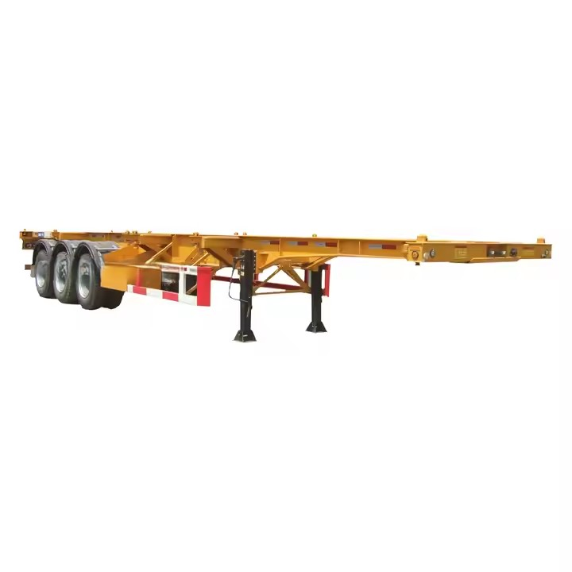
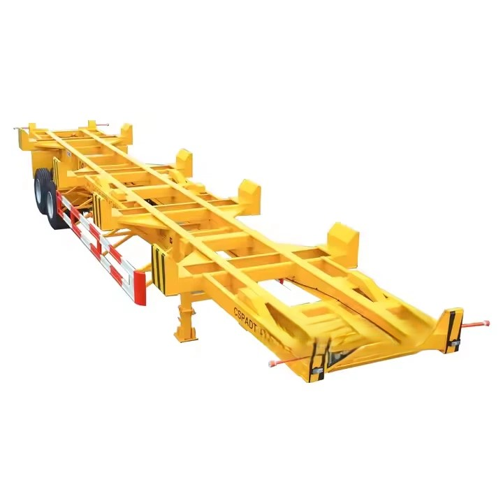
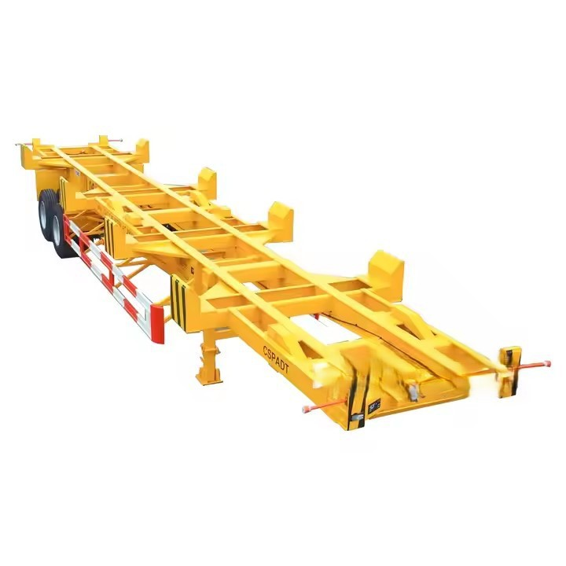

- ## Parameter

   

   

  | **Place of Origin**  | Shandong, China                      |
  | -------------------- | ------------------------------------ |
  | **Use**              | Truck Trailer                        |
  | **Material**         | Steel                                |
  | **Size**             | 12500x2500x1550mm                    |
  | **Product name**     | Container skeleton trailer           |
  | **Function**         | Transport 20ft 40ft Container        |
  | **Loading capacity** | 30T-60T                              |
  | **Landing Gear**     | 28t Heavy Duty Landing Gear          |
  | **Suspension**       | Mechanical Suspension Air Suspension |
  | **Axle**             | 2/3/4*13/16T FUWA/BPW/Other brand    |
  | **King pin**         | 2"(50mm)or3.5"(90mm) JOST            |
  | **Tire**             | 11.00r20 12r22.5 315 385             |
  | **Brake System**     | WABCO Valve                          |
  | **Condition**        | Brand-new                            |

   

  Types of Skeletal Trailer

   

  The skeletal trailers produced by our company mainly include the following types: 

  Tri Axle Container Chassis

  A three - axle container chassis possesses distinct characteristics and numerous advantages, making it a preferred choice in the field of container transportation. The three - axle design provides a stable and robust load - bearing structure.

  2 Axle Container Chassis

  The two - axle design gives the trailer a relatively compact structure. It is mainly composed of a strong steel frame that can firmly support the 40 - foot container. Despite its simplicity, the structure is robust enough to handle the weight of the container.

  

   

  ##### Key Features of Skeleton Trailers

   

  Modular Chassis Design

  Some skeleton trailers are modular, allowing sections of the trailer to be adjusted or extended to accommodate oversized or irregularly shaped cargo. This versatility is beneficial for transporting non-standard loads.

  01

  Telescopic Twisted Locks

  Advanced models may feature telescopic twist locks that can adjust to different container heights automatically. This will ensure that containers are sticked and secured to their place effortlessly.

  02

  Multi-Axle Configurations

  Advanced skeleton trailers for sale offer multiple axle configurations, including tri-axle or even quad-axle setups. These configurations distribute weight more evenly and enhance the trailer’s ability to carry heavy loads without exceeding respective weight limits.

  03

  Foldable or Retractable Rear End

  Certain skeleton trailers feature a folding or retractable rear end. This design allows the trailer to extend its length when necessary for transporting longer containers while maintaining manoeuvrability.

  04

  Air Suspension

  Skeleton trailers are equipped with air suspension systems, which provide a smoother ride and better load stability, especially over uneven terrain. This feature helps to reduce wear and tear on the trailer and even a container.

  05

   

  ##### Uses of Skeleton Trailers

  

   

  Intermodal Transportation

   

  One of the primary uses of skeleton trailers is facilitating intermodal transport. They are designed to efficiently transfer shipping containers between different modes of transportation, such as ships, trains, and trucks.

  Heavy-duty Container Handling

   

  Another key use of skeleton trailers is their ability to handle size-varied shipping containers efficiently. Their structural integrity and weight-bearing capacity of over 4500 kg make them suitable for all cargos.

  Long-haul Transportation

   

  Uses of skeleton trailers include their application in long-distance transportation routes, where they efficiently carry containers over highways and freeways between cities and regions. This factor also continues to save cost and improves overall logistic operations.

   

  Dimensions of Skeletal Trailer

   

  **12ft**
  The 12ft skeleton trailer is a robust-framed skeleton designed to carry a 12ft intermodal shipping container. Being a 12ft trailer, it is considerably smaller in size, and therefore easier to handle in a tight space, such as ports, warehouses, and even areas in the heart of towns.

   

  **40ft**
  The 40ft skeleton trailer is engineered to transport ISO-standard containers, accommodating either two 20ft containers or one 40ft container. Constructed from high-strength materials like Q345 or SM490 steel, it ensures exceptional durability and offers a payload capacity often exceeding 30 tons. Key features include multiple twist locks for secure container fastening, dual or tri-axle configurations for heavy loads, and advanced braking systems for enhanced safety. Widely used in intermodal transport, the 40ft skeleton trailer facilitates the seamless transfer of goods across ships, trucks, and trains.

   

  **45ft**
  The 45ft skeleton trailer is designed for transporting 45-foot shipping containers, commonly used in intermodal transportation. Its open, skeletal frame minimizes weight while providing the strength to support large containers, making it ideal for efficient loading and unloading, especially with cranes or forklifts. The trailer’s twist-lock mechanisms securely fasten containers, and its versatility allows it to accommodate different container sizes, making it a cost-effective solution for long-distance logistics across highways, railways, and ports.

   

   

  Steps for Hooking a Skeletal Trailer to a Truck

  1. When connecting, the trailer skateboard must be at the same level as the towing seat panel or slightly lower (up to 50mm) than the towing seat panel. A word of warning here, if you are using air suspension, the height should be slightly higher. The air suspension is softer and filled with air. If there is cargo on top of the trailer, the air will be compressed, and the height will be lower than usual.

   

  2. When the tractor seat is in the pre-hung state (that is, the handle is pulled out), slowly drive the truck under the semi-trailer. The locking mechanism will automatically close, the handle of the tractor seat will return, and the dial will be in the return position. After the connection is complete, move the tractor slightly forward to check if the trailer hookup is good.

   

  3.After the connection is completed, check and confirm that the locking mechanism of the tractor seat is locked before driving the truck.

  

   

  

   

  Precautions for Skeletal Trailer Use

  1. Check whether the tractor and the semi-trailer match before connecting. If the bottom surface of the semi-trailer's traction pin plate is not suitable for the height of the plane center of the towing seat body, it cannot be connected. At the same time, pay attention to the container's oncoming surface distance. Prevent collision between the front face of the container and the tractor when the train turns.

   

  2. When connecting, please note that the bottom surface of the semi-trailer traction pin plate is 1-30mm lower than the center of the upper surface of the traction seat body. Make sure that the separation joystick is in the separated state. The longitudinal symmetry plane of the tractor and semi-trailer should be consistent, and the deviation should be less than 40mm.

   

  3. After connecting, check the position of the lock block carefully to prevent the lock block from bounce off when driving. The span hose joint that connects the semi-trailer and the tractor needs to be connected to the brake pipeline of the train, and check the pressure of each part Whether it meets the specified value. Connect the circuit of the semi-trailer and the tractor to ensure that the various signals of the semi-trailer work normally.

   

  4. Separate the electrical connector and the jumper hose joint before unhooking. Make sure that the semi-trailer is parked reliably, and then shake the outrigger handle to make the outrigger fall to the ground, and raise the semi-trailer tire by 20-500mm for traction. The car slowly left the semi-trailer.

   

   

  ## Packaging and Shipping

   

   

  | **Packaging** | Polish with wax before shipping. Nude packing.               |
  | ------------- | ------------------------------------------------------------ |
  | **Shipping**  | We will provide you with the best ocean shipping solution to reduce transportation costs and ensure timely delivery of goods. |

   

   

  ## Our Factory

   

  The production base of Ruiyuan Semi-trailers is located in an industrial park with convenient transportation. The factory area is spacious, and the production equipment is advanced.

   

  

   

  ##### Our Service

   

  **Financing Services**
  A variety of financial services are provided to customers, including vehicle purchase loans, installment payments, etc., to help customers reduce the purchase cost and achieve flexible payment plans.

   

  **Technical Support**
  Comprehensive technical support is provided to help customers understand the applicable scenarios and advantages of different types of semi-trailers, ensuring that their purchasing decisions are reasonable.

   

  **Installation and Debugging**
  Professional installation and debugging services are provided to ensure that all functions of the semi-trailer operate normally, the vehicle meets safety standards, and customers can start using it without worry.

   

  **Technical Support and Training**
  Professional training is provided for vehicle owners and drivers to ensure that the users can master the operation skills and maintenance key points of the semi-trailer proficiently. Ruiyuan also provides regular technical support, including operation manuals, online help, etc., to answer the technical problems encountered by customers during the use process.

   

  **Spare Parts Supply**
  Original spare parts are provided for guarantee. When customers repair or replace spare parts, they can obtain high-quality spare parts produced by Ruiyuan to ensure the performance and safety of the vehicle.

   

  **Product Upgrades and Modifications**
  Ruiyuan also provides modification services for semi-trailers, such as adding additional vehicle-mounted equipment, increasing additional load capacity, etc., to ensure that the semi-trailer meets the changing transportation needs.

   

  **Quality Follow-up and Customer Feedback**
  Ruiyuan will regularly follow up with customers, collect usage feedback, promptly identify potential problems and make improvements to enhance the quality of products and service levels.

   

   

  ## FAQ

   

   

  Q: What is a skeletal trailer?

  A: A skeletal trailer is a type of semi - trailer that has a basic frame or “skeleton” structure. It is mainly used for transporting containers, such as shipping containers, and lacks a solid cargo - carrying deck or enclosure like traditional trailers.

  Q: How does a skeletal trailer differ from a flat - bed trailer?

  A: A skeletal trailer is specifically designed for container transportation and has a frame that is tailored to fit and secure containers. In contrast, a flat - bed trailer has a solid, flat surface that can carry a wide variety of non - containerized cargo, including large machinery, construction materials, and vehicles.

  Q: What are the main components of a skeletal trailer?

  A: The main components include the chassis frame, axles, suspension system, coupling device (such as a fifth - wheel coupling for connection to the tractor), and container - locking mechanisms.

  Q: What types of containers can a skeletal trailer transport?

  A: Skeletal trailers are commonly used to transport standard ISO shipping containers, which come in various sizes like 20 - foot, 40 - foot, and 45 - foot containers. They can also transport specialized containers such as refrigerated containers (reefers) and tank containers if properly equipped.

  Q: What is the typical load - bearing capacity of a skeletal trailer?

  A: The load - bearing capacity depends on the design and number of axles. Generally, a well - designed skeletal trailer can carry loads ranging from 20 to 30 tons or more, depending on the axle configuration and local regulations.

  Q: How do you choose the right skeletal trailer for a business?

  A: Consider factors such as the types of containers to be transported, the typical load weight, the distance of transportation, and local regulations. Also, evaluate the reputation of the manufacturer, the quality of the trailer's components, and the availability of after - sales service.
