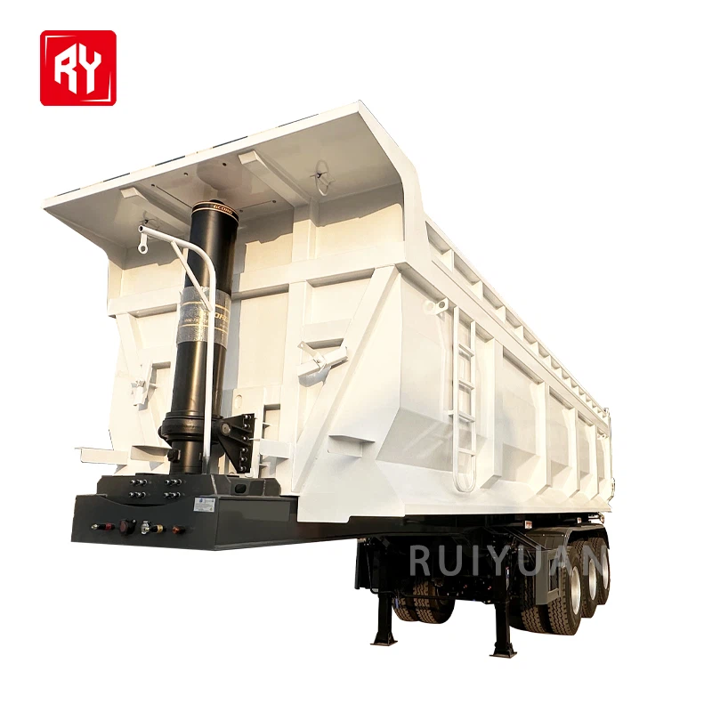
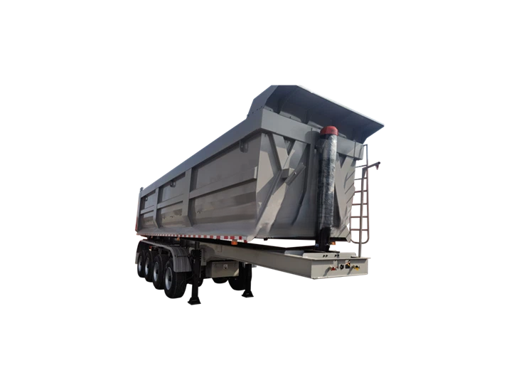

- ## Parameter

   

   

  | **Type:**                  | Semi-trailer                                                 |
  | -------------------------- | ------------------------------------------------------------ |
  | **Maximum load :**         | 40-50T                                                       |
  | **Brand :**                | Shandongruiyaun                                              |
  | **Country of Origin:**     | Shandong,China                                               |
  | **Suitable vehicle type:** | Truck towing                                                 |
  | **Material:**              | Steel0                                                       |
  | **Size:**                  | 13000*2500*3900(can be customized according to requirements) |
  | **Product Name:**          | Dump truck trailer                                           |
  | **Axle:**                  | Zy/13/14/16 tons                                             |
  | **Main beam:**             | T700/Q345 steel, height: 500mm, plate thickness: 8-16mm      |
  | **Suspension:**            | Single point hanging                                         |
  | **Conditions:**            | According to the request on                                  |
  | **Tires:**                 | 11.00 R20/12.00 R20 r22/12. 5                                |
  | **Brake air chamber:**     | 6 sets                                                       |
  | **Landing gear:**          | 28t*2,JOST brand                                             |
  | **Electrical system:**     | 24v, a set of 6-core standard cable                          |
  | **Color:**                 | Customer optional                                            |

   

  Types of Tipper Semi Trailer

   

  The tipper semi trailers produced by our company mainly include the following types: 

  3 Axle End Dump Semi Trailers

  Equipped with three axles, these semi - trailers have a strong load - bearing capacity. The axle configuration allows for a more even distribution of the load, enabling the trailer to carry heavy cargoes. Usually, the load - bearing capacity can reach 30 - 40 tons or even more, meeting the transportation needs of large - scale construction materials, ores and other heavy goods.

  4 Axle Tipper Semi Trailer

  Four - axle tipper semi - trailers are equipped with four axles, which evenly distribute the load. This enables them to carry heavy loads, usually ranging from 30 to 60 tons, depending on the specific model and configuration. The multiple axles also help to reduce the pressure on each tire, increasing the overall load - carrying capacity of the vehicle.

  

   

  ##### Advantages of Tipper Semi Trailer

   

  Faster Unloading:

  The ability to tip the bed allows for faster unloading compared to traditional trailers, reducing the time spent at delivery sites and improving operational efficiency.

  01

  Increased Productivity:

  By reducing the need for manual unloading, tipper trailers speed up the overall process, allowing businesses to complete more jobs per day.

  02

  Ease of Use:

  Tipper trailers require less manual labor for unloading, which minimizes the need for additional equipment like cranes or forklifts, lowering labor costs and simplifying operations.

  03

  Improved Safety:

  The automated tipping process reduces the risk of injury to workers during unloading. The secure tipping mechanism ensures that the cargo is unloaded in a controlled manner, preventing spills or accidents.

  04

  Versatility:

  Tipper semi trailers are suitable for a wide range of applications, including the transportation of construction materials, agricultural products, waste, and even hazardous materials (with the proper safety measures). This versatility makes them a valuable asset for various industries.

  05

   

  ##### Applications of Tipper Semi Trailer

   

  Construction industry

  Tipper semi trailer is commonly used to transport various construction materials. Common ones are such as sand, stone, cement and so on. These materials are usually in bulk, so they need efficient unloading methods for loading and unloading. tipper semi trailer is one of the best options.

  Agriculture and logistics

  Tipper semi trailer is also often used for the transportation of agricultural products. For example, grains, vegetables, fertilizers and so on. This model is very suitable for the narrow road environment in rural areas.

  Mining

  In the mining industry, tipper semi trailers are widely used for ore transportation. Since the ore usually weighs a lot and has a large volume, it is not particularly good for transportation. Therefore, it is necessary to use the tipper semi trailer with very high unloading efficiency. It can effectively improve the transportation efficiency.

  Waste disposal

  Tipper semi trailers are also capable of efficiently unloading waste materials and construction waste. Due to the characteristics of side tipping unloading, it is able to seek to empty the model in a limited space. It is especially suitable for scenarios that require frequent transportation of bulk waste materials.

   

  

   

  Safety Precautions for Using Tipper Semi Trailers

  1. Check all components to ensure that the Tipper semi-trailer is in good condition. Check the tire pressure standard and the level of tightness of the tire screws. The wear of the brake disc depends on the lock gear arm bolts and the replacement of the arm sleeve. The wear or damage of the arm sleeve is the key root cause of the brake disc wear. Therefore, during inspection and maintenance , The pull arm sleeve should be removed first.

  

  2. Check the traction pin. The upper and lower error of the traction pin is too large. Tipper semi-trailer will flick the tail during driving. Generally, the original error is within 5mm, which will not cause the car to flick. Flick condition.

  

  3. The calibration vehicle must be in a flat and smooth field. A flat and smooth work field can increase the success rate and rate of calibration.

  

  4. When the Tipper semi-trailer starter is in the hot state, never open the heat pipe radiator cover, or you will be scalded by splashing coolant or high temperature steam.

   

  ##### Customization Options

   

  Load - bearing capacity

  1

  \>>

  Axle configuration

  2

  \>>

  Cargo box structure

  3

  \>>

  Dump style

  4

  \>>

  Hydraulic system

  5

  \>>

  Tire

  6

  \>>

  Color

  7

   

   

  ## Packaging and Shipping

   

   

  | **Packaging** | Polish with wax before shipping. Nude packing.               |
  | ------------- | ------------------------------------------------------------ |
  | **Shipping**  | We will provide you with the best ocean shipping solution to reduce transportation costs and ensure timely delivery of goods. |

   

   

  ## Our Factory

   

  The production base of Ruiyuan Semi-trailers is located in an industrial park with convenient transportation. The factory area is spacious, and the production equipment is advanced.

   

  

   

  ##### Our Service

   

  **Financing Services**
  A variety of financial services are provided to customers, including vehicle purchase loans, installment payments, etc., to help customers reduce the purchase cost and achieve flexible payment plans.

   

  **Technical Support**
  Comprehensive technical support is provided to help customers understand the applicable scenarios and advantages of different types of semi-trailers, ensuring that their purchasing decisions are reasonable.

   

  **Installation and Debugging**
  Professional installation and debugging services are provided to ensure that all functions of the semi-trailer operate normally, the vehicle meets safety standards, and customers can start using it without worry.

   

  **Technical Support and Training**
  Professional training is provided for vehicle owners and drivers to ensure that the users can master the operation skills and maintenance key points of the semi-trailer proficiently. Ruiyuan also provides regular technical support, including operation manuals, online help, etc., to answer the technical problems encountered by customers during the use process.

   

  **Spare Parts Supply**
  Original spare parts are provided for guarantee. When customers repair or replace spare parts, they can obtain high-quality spare parts produced by Ruiyuan to ensure the performance and safety of the vehicle.

   

  **Product Upgrades and Modifications**
  Ruiyuan also provides modification services for semi-trailers, such as adding additional vehicle-mounted equipment, increasing additional load capacity, etc., to ensure that the semi-trailer meets the changing transportation needs.

   

  **Quality Follow-up and Customer Feedback**
  Ruiyuan will regularly follow up with customers, collect usage feedback, promptly identify potential problems and make improvements to enhance the quality of products and service levels.

   

   

  ## FAQ

   

   

  Q: What is the difference between a tipper and a trailer?

  A: Regular trailers are not made for these circumstances, as you would require manual labour using shovels to remove the trailer materials. In contrast, tipper trailers use a hydraulic powered tilt function to loosen materials and deposit them where needed, with no manual labour required.

  Q: How does the tipper mechanism work?

  A: A hydraulic tipper truck uses a hoist mechanism filled with liquid to raise the dump body the materials handling tray of the truck to empty it. The pressure in the confined system is increased by applying force to one place only, allowing the pistons and cylinders to function well.

  Q: How does a tipper semi trailer differ from a regular semi trailer?

  A: The main difference is that a tipper semi trailer is equipped with a hydraulic tipping mechanism that allows the cargo box to be tilted at a certain angle for unloading, while a regular semi trailer does not have this function and is mainly used for general cargo transportation.

  Q: What materials are usually used for the cargo box of a tipper semi trailer?

  A: High strength steel such as Q345 and T700 is commonly used. These steels have good strength and wear resistance, which can withstand the impact and friction of bulk materials. Some tipper semi trailers may also use special alloy steels or wear resistant steels for the cargo box to improve its service life in harsh working conditions.

  Q: What is the maximum loading capacity of a tipper semi trailer?

  A: The maximum loading capacity of a tipper semi trailer varies depending on its design and configuration. Generally, it can range from 30 tons to 100 tons or more. The load bearing capacity is determined by factors such as the strength of the frame, the number and type of axles, and the tire specifications.

  Q: How to maintain the hydraulic system of a tipper semi trailer?

  A: Regularly check the oil level and quality of the hydraulic oil, and replace the oil and filters according to the manufacturer's recommendations. Inspect the hydraulic hoses and seals for any signs of leakage or damage and replace them promptly. Keep the hydraulic system clean and free from dirt and debris. Also, check the operation of the hydraulic pump and control valves regularly to ensure their normal function.
